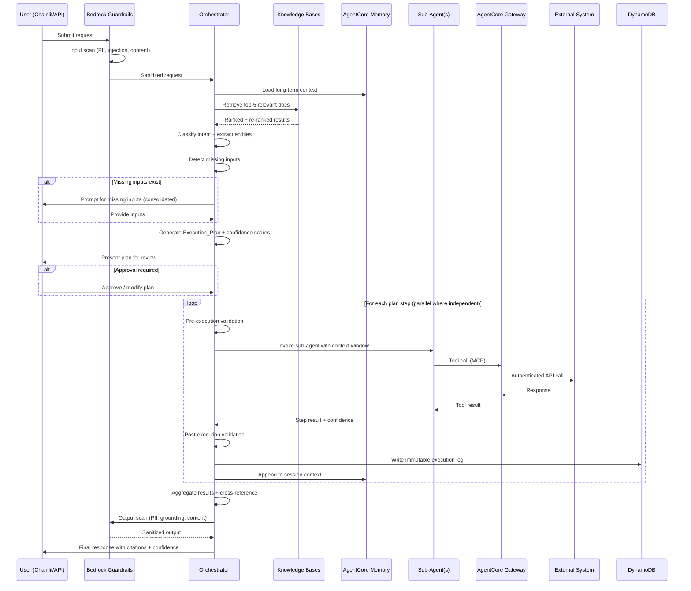
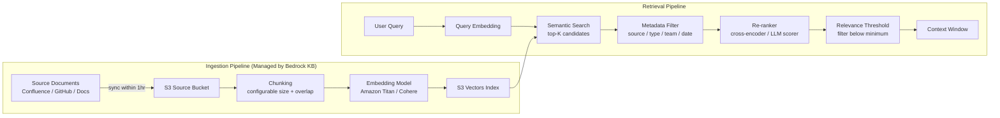
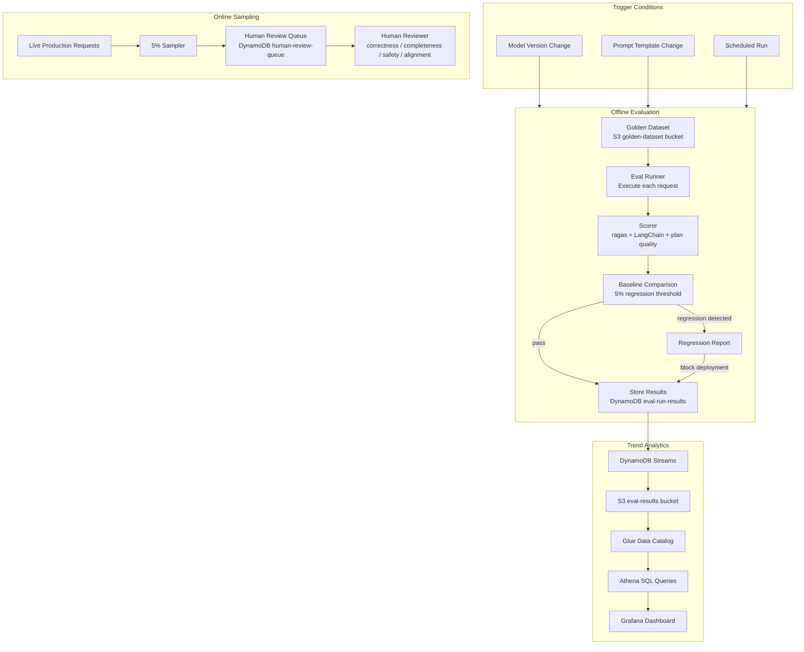

# Architecture Document: AWS Cloud Engineering Agent

> **This is the full system architecture for the AWS Cloud Engineering Agent.**
> It defines the complete technical design, component interactions, data models, and infrastructure structure. It is NOT a single feature design — it is the architectural reference that individual feature specs draw from.
>
> See [`roadmap.md`](./roadmap.md) for the delivery plan.
> See [`vision.md`](./vision.md) for the full requirements catalog.

## Overview

The AWS Cloud Engineering Agent is a multi-agent system that acts as a senior Cloud Engineer co-worker for internal teams. It accepts natural language or structured requests, decomposes them into an ordered execution plan, validates each step, prompts for missing inputs, and orchestrates specialized sub-agents to interact with internal tools and knowledge systems. The system is built on Amazon Bedrock AgentCore Runtime with LangChain (LangGraph for multi-agent orchestration, LangChain for tool integrations and RAG), using Claude via Amazon Bedrock as the default foundation model.

All infrastructure is defined as CloudFormation IaC across two parameter sets (local, production), making the system fully reproducible and deployable from a single command. The architecture prioritizes correctness, auditability, and senior-engineer-quality outputs through multi-source cross-referencing, confidence scoring, guardrails, and a comprehensive evaluation pipeline.

### Key Design Principles

- **Correctness over speed**: Every plan step is validated pre- and post-execution; outputs are cross-referenced against at least two independent sources before being presented.
- **Transparency**: Execution plans are shown to users before execution; every decision is logged with confidence scores and supporting evidence.
- **Least privilege**: Each sub-agent has a scoped IAM role and a defined allowed-action set enforced by the Orchestrator.
- **Observability-first**: Every agent container emits ADOT traces, metrics, and logs; AgentCore Observability (CloudWatch-powered) provides the primary production layer; locally, Langfuse captures LLM-specific traces, VictoriaMetrics stores metrics, and Grafana provides dashboards — all via docker-compose only.
- **Infrastructure as code**: All AWS resources are CloudFormation-managed; no manual console operations are required.

---

## Architecture

### System Architecture Diagram

```mermaid
graph TB
    subgraph Users["User Interfaces"]
        API[REST API / JSON]
        CHAINLIT[Chainlit Chat UI<br/>ECS Fargate]
    end

    subgraph AgentCore["Amazon Bedrock AgentCore Runtime (Firecracker VM Isolation)"]
        ORCH[Orchestrator Agent<br/>LangGraph + Claude]
        subgraph SubAgents["Sub-Agents (N) — registry-driven, extensible"]
            CA[Confluence_Agent<br/>knowledge_documentation]
            CWA[CloudWatch_Agent<br/>observability_monitoring]
            VMA[VictoriaMetrics_Agent<br/>observability_monitoring]
            GHA[GitHub_Agent<br/>source_control_cicd]
            DOTS[... any future agent<br/>registered in subagent-registry]
        end
    end

    subgraph Gateway["AgentCore Gateway (MCP Protocol)"]
        GW[MCP Tool Endpoints<br/>OAuth2 Auth]
    end

    subgraph ExternalTools["External Systems"]
        CONF[Confluence]
        CW[CloudWatch]
        VM[VictoriaMetrics]
        GH[GitHub]
    end

    subgraph Memory["AgentCore Memory"]
        STM[Short-Term Memory<br/>Session Context]
        LTM[Long-Term Memory<br/>Cross-Session]
    end

    subgraph Knowledge["Bedrock Knowledge Bases"]
        KB[Knowledge Base<br/>S3 + S3 Vectors]
        RERANK[Re-ranker]
    end

    subgraph Guardrails["Bedrock Guardrails"]
        GRD[PII + Injection +<br/>Content + Grounding]
    end

    subgraph DataLayer["Data Layer"]
        DDB[(DynamoDB<br/>7 Tables)]
        S3[(S3<br/>3 Buckets)]
        ATHENA[Athena + Glue]
    end

    subgraph Observability["Observability Stack"]
        ACOBS[AgentCore Observability<br/>CloudWatch-powered — all features enabled]
        OTEL[ADOT Collector]
        XRAY[AWS X-Ray]
        LF[Langfuse<br/>(local docker-compose only)]
        VMOBS[VictoriaMetrics<br/>(local docker-compose only)]
        GRAF[Grafana<br/>(local docker-compose only)]
        JAEGER[Jaeger<br/>(local docker-compose only)]
    end

    subgraph Identity["AgentCore Identity"]
        IDP[Okta / Azure Entra ID]
        SM[Secrets Manager]
    end

    API --> ORCH
    CHAINLIT --> ORCH
    ORCH --> SubAgents
    ORCH --> Memory
    ORCH --> Knowledge
    ORCH --> Guardrails
    ORCH --> DDB
    SubAgents --> GW
    GW --> ExternalTools
    GW --> Identity
    ORCH --> OTEL
    SubAgents --> OTEL
    OTEL --> XRAY
    OTEL --> LF
    OTEL --> VMOBS
    VMOBS --> GRAF
    XRAY --> GRAF
    LF --> GRAF
    DDB --> S3
    S3 --> ATHENA
```

### Request Lifecycle Flow



---

## Components and Interfaces

### Framework: LangChain + LangGraph

All agents are implemented using LangChain and LangGraph:

- **LangGraph** drives the Orchestrator's stateful multi-agent graph — nodes represent plan steps, edges represent conditional transitions (retry, escalate, parallel fan-out), and the graph state carries the full `ContextWindow` across all hops.
- **LangChain** provides the tool abstraction layer for all Sub-Agents — each tool integration (Confluence, CloudWatch, VictoriaMetrics, GitHub) is implemented as a `BaseTool` subclass invoked via AgentCore Gateway (MCP).
- **LangChain Bedrock integration** (`langchain-aws`) provides the `ChatBedrock` LLM wrapper for Claude, with Bedrock Guardrails applied via the `guardrailConfig` parameter on every invocation.
- **LangChain Bedrock Knowledge Bases retriever** (`AmazonKnowledgeBasesRetriever`) handles RAG retrieval with metadata filtering and configurable top-K.
- **LangChain callbacks** (`langfuse.langchain.CallbackHandler`) instrument LLM calls, tool invocations, and chain steps for Langfuse tracing **in local development only** (`OTEL_STACK=local`). The handler is passed via `config={"callbacks": [langfuse_handler]}` on each chain invocation. In production, AgentCore Observability handles trace capture.

### LangGraph Orchestrator State

The Orchestrator's `StateGraph` carries the following typed state across all nodes:

```python
from typing import TypedDict, List, Optional, Dict, Any
from langgraph.graph import StateGraph

class OrchestratorState(TypedDict):
    # Request
    raw_request: str
    task_category: Optional[str]          # classified category
    entities: Dict[str, Any]              # extracted entities
    confidence_score: float               # classification confidence
    clarifying_question: Optional[str]    # set when confidence < 0.7

    # Plan
    execution_plan: List[Dict[str, Any]]  # ordered list of steps
    missing_inputs: List[Dict[str, Any]]  # unresolved missing inputs
    pending_approval: bool                # waiting for user confirmation

    # Execution
    current_step_index: int
    hop_count: int                        # enforces max 10 hops
    token_budget_used: int
    token_budget_limit: int
    visited_steps: List[str]              # (agent_id, inputs_hash) for cycle detection
    step_results: List[Dict[str, Any]]    # accumulated sub-agent outputs

    # Context
    context_window: List[Any]             # LangChain Document objects + step outputs
    session_id: str
    user_id: str

    # Output
    final_response: Optional[str]
    citations: List[Dict[str, Any]]       # source title, URL, timestamp
    error: Optional[Dict[str, Any]]
```

**Graph nodes:** `classify_request`, `retrieve_knowledge`, `detect_missing_inputs`, `prompt_user`, `generate_plan`, `present_plan`, `validate_step_pre`, `invoke_subagent`, `validate_step_post`, `aggregate_results`, `scan_output_guardrails`, `write_execution_log`

**Conditional edges:** retry (on post-validation failure, max 2), escalate (on persistent failure), parallel_fan_out (for independent steps), hop_limit_check, cycle_check, token_budget_check

### AgentCore Memory ↔ LangGraph Integration

AgentCore Memory is integrated with LangGraph via the official `langgraph-checkpoint-aws` package, which provides two integration classes:

```python
# Short-term memory: LangGraph checkpoint persistence
from langgraph_checkpoint_aws import AgentCoreMemorySaver

checkpointer = AgentCoreMemorySaver(memory_client=AgentCoreMemoryClient())
graph = build_graph().compile(checkpointer=checkpointer)

# Invoke with session config — state is automatically persisted between turns
result = await graph.ainvoke(
    {"raw_request": user_input},
    config={"configurable": {"thread_id": session_id, "actor_id": user_id}}
)
```

```python
# Long-term memory: semantic retrieval across sessions
from langgraph_checkpoint_aws import AgentCoreMemoryStore

store = AgentCoreMemoryStore(memory_client=AgentCoreMemoryClient())

# At session start — retrieve relevant long-term context
long_term_context = await store.search(
    namespace=(user_id,),
    query=raw_request,
    limit=5
)
# Inject into initial context_window state
```

The `AgentCoreMemorySaver` handles short-term (multi-turn) checkpoint objects including user/AI messages, graph execution state, and metadata. The `AgentCoreMemoryStore` handles long-term memory with background extraction of insights, summaries, and user preferences. Both are scoped to the authenticated user identity so one user's memory is never accessible to another.

### Prompt Template Registry ↔ LangChain Integration

Prompt templates stored in the `prompt-template-registry` DynamoDB table are loaded at runtime and instantiated as LangChain `ChatPromptTemplate` objects:

```python
from langchain_core.prompts import ChatPromptTemplate

def load_prompt_template(task_category: str, version: str = "active") -> ChatPromptTemplate:
    """Loads the active Prompt_Template from DynamoDB and returns a ChatPromptTemplate."""
    record = dynamodb.get_item(table="prompt-template-registry",
                               pk=task_category, sk=version)
    return ChatPromptTemplate.from_messages([
        ("system", record["systemPrompt"]),
        *[(ex["role"], ex["content"]) for ex in record["fewShotExamples"]],
        ("human", "{input}"),
    ])
```

The template ID and version are recorded in the execution log on every invocation (Req 16.2).

### Orchestrator Agent

The Orchestrator is the top-level agent deployed on AgentCore Runtime. It owns the full request lifecycle: intake, classification, plan generation, validation, sub-agent coordination, and response synthesis.

**Responsibilities:**
- Accept requests from Chainlit UI or direct API
- Classify requests into task categories (incident investigation, infrastructure change, cost analysis, deployment, monitoring query, knowledge retrieval, code review)
- Extract entities (service names, time ranges, environments, resource IDs)
- Query AgentCore Memory for long-term context
- Query Bedrock Knowledge Bases for relevant documents
- Detect missing inputs and consolidate prompts
- Generate and present Execution_Plans with per-step confidence scores
- Enforce pre- and post-execution validation on every step
- Coordinate parallel and sequential sub-agent invocations
- Enforce hop limits (max 10), cycle detection, and token budget
- Aggregate sub-agent outputs into a unified response
- Cross-reference outputs against at least two independent sources
- Write immutable execution logs to DynamoDB
- Sample 5% of requests for human review queue

**Key interfaces:**
- Inbound: HTTP/WebSocket from Chainlit UI or API gateway
- Outbound: LangGraph `StateGraph` node invocations for sub-agents
- Outbound: `AmazonKnowledgeBasesRetriever` for Bedrock Knowledge Bases
- Outbound: AgentCore Memory read/write API
- Outbound: `ChatBedrock` with `guardrailConfig` for Bedrock Guardrails
- Outbound: DynamoDB for execution logs, session state, registries

### Sub-Agent Design

Each sub-agent is a separate AgentCore Runtime endpoint implemented as a LangChain `AgentExecutor` (or LangGraph `StateGraph` for multi-step sub-agents). All sub-agents share the same structural pattern: they receive a context window from the Orchestrator, invoke tools via AgentCore Gateway (MCP) using LangChain `BaseTool` subclasses, and return a structured result with a confidence score.

The `langfuse.langchain.CallbackHandler` is conditionally attached to every `AgentExecutor` and `ChatBedrock` chain invocation via `config={"callbacks": [langfuse_handler]}` **when `OTEL_STACK=local`**. In production, the handler is not wired — AgentCore Observability handles LLM trace capture.

**Common sub-agent interface:**

```
Input:
  - task: string                    # Step description from execution plan
  - context_window: ContextWindow   # Full accumulated context
  - tool_inputs: Map<string, any>   # Validated tool parameters
  - session_token: string           # Scoped AgentCore Identity token

Output:
  - result: any                     # Tool output
  - confidence_score: float         # 0.0–1.0
  - sources: Citation[]             # Source title, URL, timestamp
  - error: StepError | null         # Structured error if failed
```

---

## Sub-Agent Integration Framework

The Orchestrator has **no hardcoded knowledge** of specific sub-agents. It only knows three things:

1. The standard sub-agent interface contract (input/output schema above)
2. How to query the `subagent-registry` DynamoDB table to discover available agents
3. How to match a plan step's required capability to a registered agent's `capabilityDescriptor`

This means adding any new integration — NewRelic, Dynatrace, OpsGenie, Microsoft Teams, Slack, Datadog, or anything else — requires **zero changes** to the Orchestrator.

### The Four-Step Onboarding Checklist

```
1. src/agents/<name>/tools.py          — BaseTool subclasses for each tool
2. src/agents/<name>/agent.py          — AgentExecutor via base.py factory
3. cloudformation/stacks/application/
       agents/<name>.yaml              — agent-runtime-endpoint module
4. subagent-registry DynamoDB table    — register with full capability record
```

After step 4, the Orchestrator discovers the new agent on the next request. No restarts, no redeployments of existing stacks.

### subagent-registry Record Schema

Every registered agent must have all of these fields:

```json
{
  "agentId": "newrelic-agent",
  "displayName": "NewRelic Agent",
  "capabilityDescriptor": "Queries NewRelic APM for application performance metrics, error rates, throughput, and distributed traces. Supports NRQL queries and alert policy retrieval.",
  "category": "observability_monitoring",
  "supportedTools": ["newrelic.nrql_query", "newrelic.get_alert_policies", "newrelic.get_apm_summary"],
  "inputSchema": { "$schema": "...", "type": "object", "properties": { "task": {...}, "context_window": {...}, "tool_inputs": {...} } },
  "outputSchema": { "$schema": "...", "type": "object", "properties": { "result": {...}, "confidence_score": {...}, "sources": {...}, "error": {...} } },
  "allowedActions": ["newrelic:QueryMetrics", "newrelic:GetAlerts"],
  "runtimeEndpointArn": "arn:aws:bedrock-agentcore:...",
  "version": "1.0.0",
  "healthStatus": "HEALTHY",
  "lastHealthCheck": "2024-01-15T10:30:00Z",
  "registeredAt": "2024-01-10T09:00:00Z",
  "status": "ACTIVE"
}
```

### Capability Matching Algorithm

The Orchestrator selects a sub-agent for each plan step using a two-phase match:

**Phase 1 — Category filter:** The plan step descriptor includes an `expectedCategory` field (one of the six integration categories). The Orchestrator filters the registry to agents in that category with `status = ACTIVE` and `healthStatus != UNAVAILABLE`.

**Phase 2 — Capability score:** For each candidate agent, the Orchestrator computes a semantic similarity score between the step's `requiredCapability` string and the agent's `capabilityDescriptor`. The agent with the highest score is selected.

```python
# src/orchestrator/nodes/invoke_subagent.py (simplified)
def select_subagent(step: PlanStep, registry: list[SubAgentRecord]) -> SubAgentRecord:
    candidates = [
        r for r in registry
        if r["category"] == step["expectedCategory"]
        and r["status"] == "ACTIVE"
        and r["healthStatus"] != "UNAVAILABLE"
    ]
    if not candidates:
        raise NoAvailableSubAgentError(step["expectedCategory"])
    # Semantic similarity via embedding comparison (or LLM scoring for small candidate sets)
    scored = [(r, similarity(step["requiredCapability"], r["capabilityDescriptor"])) for r in candidates]
    return max(scored, key=lambda x: x[1])[0]
```

### Integration Categories

| Category | Description | Reference Implementations | Example Future Integrations |
|---|---|---|---|
| `observability_monitoring` | Metrics, logs, traces, dashboards | CloudWatch_Agent, VictoriaMetrics_Agent | NewRelic, Datadog, Dynatrace, Grafana Cloud |
| `incident_management` | Incidents, alerts, on-call workflows | *(none in current roadmap — catalog entries only)* | PagerDuty, OpsGenie, VictoriaMetrics Alertmanager |
| `communication_collaboration` | Messaging, tickets, team content | Confluence_Agent | Microsoft Teams, Slack, Jira |
| `source_control_cicd` | Code repos, PRs, pipelines, deployments | GitHub_Agent | GitLab, Jenkins, ArgoCD |
| `infrastructure_cloud` | Cloud infra, IaC state, cost data | *(none in current roadmap — catalog entries only)* | AWS Cost Explorer, Terraform Cloud, Infracost |
| `knowledge_documentation` | Runbooks, wikis, architectural docs | Confluence_Agent | Notion, internal wiki systems |

### Health Status Lifecycle

The `healthStatus` field in the registry is updated by each agent's `/ping` health check, polled by a background process. The Orchestrator reads this field at plan-time:

```
HEALTHY     → eligible for routing
DEGRADED    → eligible for routing; Orchestrator logs a warning and may prefer alternatives
UNAVAILABLE → excluded from routing; Orchestrator logs a warning and falls back to alternatives or escalates
```

---

## Reference Implementations

The following sub-agents are the initial reference implementations of the Integration Sub-Agent Framework. They demonstrate the pattern all integrations must follow. They are not an exhaustive list — the framework is designed to accommodate any number of additional integrations.

#### Confluence_Agent *(category: knowledge_documentation)*

- **Tools (via Gateway):** `confluence.search`, `confluence.get_page`, `confluence.get_space`
- **Input:** keyword query, semantic query, space keys, page IDs
- **Output:** page title, URL, last-modified date, excerpt, structured content (tables, code blocks, headings)
- **Error handling:** On 401/403, reports HTTP status to Orchestrator and ceases Confluence queries for the request

#### PagerDuty_Agent *(category: incident_management — catalog entry, not in current roadmap)*

> This agent is architecturally supported but not part of the current delivery roadmap. It can be added at any time using the four-step onboarding checklist with zero Orchestrator changes.

- **Tools (via Gateway):** `pagerduty.list_incidents`, `pagerduty.get_incident`, `pagerduty.get_incident_details`, `pagerduty.get_alerts`, `pagerduty.get_log_entries`
- **Input:** service name/ID, incident ID, severity filter, time range
- **Output:** incident ID, title, status, severity, assigned responder, escalation policy, event timeline, linked alerts, full incident details (body, impact, affected services, acknowledgements, resolution notes), log entries with timestamps
- **Error handling:** Returns empty result set with notification when no incidents match; propagates API errors to Orchestrator

#### CloudWatch_Agent *(category: observability_monitoring)*

- **Tools (via Gateway):** `cloudwatch.get_metric_statistics`, `cloudwatch.insights_query`, `cloudwatch.describe_anomaly_detectors`
- **Input:** namespace, metric name, dimensions, time range, log group, Insights query string
- **Output:** metric statistics (avg, p50, p95, p99, max), anomaly annotations, log events with timestamps, account ID, region, query execution time
- **Error handling:** Paginates results when >1,000 log events; returns summarized view with full-dataset retrieval option

#### VictoriaMetrics_Agent *(category: observability_monitoring)*

- **Tools (via Gateway):** `victoriametrics.query_range`, `victoriametrics.query`
- **Input:** MetricsQL query string, time range, step interval
- **Output:** metric labels, data points, query execution time
- **Error handling:** On connectivity failure, reports error to Orchestrator and marks step failed without blocking other steps

#### GitHub_Agent *(category: source_control_cicd)*

- **Tools (via Gateway):** `github.search_code`, `github.search_repositories`, `github.get_file`, `github.get_pr`, `github.get_commit`, `github.list_workflow_runs`
- **Input:** org/repo, search query (code or repo), file path, PR number, commit SHA, workflow name
- **Output:** search results (file paths, repo names, match excerpts), file content, PR summary (changes, affected resources, high-risk flags), IaC analysis results, deployment history (last 10 runs with status/actor/timestamp)
- **Error handling:** On rate-limit, notifies Orchestrator with reset time and pauses GitHub queries until reset

#### CostExplorer_Agent *(category: infrastructure_cloud — catalog entry, not in current roadmap)*

> This agent is architecturally supported but not part of the current delivery roadmap. It can be added at any time using the four-step onboarding checklist with zero Orchestrator changes.

- **Tools (via Gateway):** `cost_explorer.get_cost_and_usage`, `cost_explorer.get_cost_forecast`, `cost_explorer.get_anomalies`
- **Input:** service filter, account ID, time range, granularity (daily/monthly), tag filters
- **Output:** total cost, cost by service, cost by tag, month-over-month change, anomaly flags (service, period, delta), forecast data
- **Error handling:** On authorization error, reports HTTP status to Orchestrator and ceases cost queries for the request

### AgentCore Gateway

The Gateway is the single MCP-protocol entry point for all tool invocations. It handles:
- Tool discovery (queried by Orchestrator at startup to populate sub-agent registry)
- OAuth2 credential management via AgentCore Identity
- Per-tool rate limiting with structured error responses
- Tool registration without agent redeployment

---

## Integration Catalog

The following catalog documents the extensibility model. The five reference implementations are deployed today. All other entries are architecturally supported — adding any of them requires only the four-step checklist (Req 32.1) with zero changes to the Orchestrator.

### Observability & Monitoring (`observability_monitoring`)

| Integration | Status | Key Tools | Notes |
|---|---|---|---|
| CloudWatch | ✅ Reference impl | `get_metric_statistics`, `insights_query`, `describe_anomaly_detectors` | AWS-native metrics and logs |
| VictoriaMetrics | ✅ Reference impl | `query_range`, `query` | MetricsQL; custom observability stack |
| NewRelic | 🔲 Catalog entry | `nrql_query`, `get_apm_summary`, `get_alert_policies`, `get_distributed_traces` | APM + infrastructure metrics |
| Datadog | 🔲 Catalog entry | `metrics_query`, `logs_query`, `get_monitors`, `get_dashboards` | Full-stack observability |
| Dynatrace | 🔲 Catalog entry | `metrics_query`, `problems_query`, `smartscape_topology`, `davis_ai_analysis` | AI-powered observability |
| Grafana Cloud | 🔲 Catalog entry | `query_datasource`, `get_dashboard`, `get_alerts` | Unified metrics/logs/traces |

### Incident Management (`incident_management`)

| Integration | Status | Key Tools | Notes |
|---|---|---|---|
| PagerDuty | 🔲 Catalog entry | `list_incidents`, `get_incident`, `get_alerts`, `get_log_entries` | Primary on-call platform — not in current roadmap |
| OpsGenie | 🔲 Catalog entry | `list_alerts`, `get_alert`, `get_on_call_schedule`, `create_alert` | Alternative incident management |
| VictoriaMetrics Alertmanager | 🔲 Catalog entry | `get_alerts`, `get_silences`, `get_receivers` | Prometheus-compatible alerting |

### Communication & Collaboration (`communication_collaboration`)

| Integration | Status | Key Tools | Notes |
|---|---|---|---|
| Confluence | ✅ Reference impl | `search`, `get_page`, `get_space` | Internal docs and runbooks |
| Microsoft Teams | 🔲 Catalog entry | `send_message`, `get_channel_messages`, `create_meeting`, `search_messages` | Team communication |
| Slack | 🔲 Catalog entry | `post_message`, `search_messages`, `get_channel_history`, `get_user_info` | Real-time messaging |
| Jira | 🔲 Catalog entry | `search_issues`, `get_issue`, `create_issue`, `get_sprint` | Issue tracking and project management |

### Source Control & CI/CD (`source_control_cicd`)

| Integration | Status | Key Tools | Notes |
|---|---|---|---|
| GitHub | ✅ Reference impl | `search_code`, `get_file`, `get_pr`, `list_workflow_runs` | Primary source control |
| GitLab | 🔲 Catalog entry | `search_code`, `get_file`, `get_merge_request`, `list_pipelines` | Alternative source control |
| Jenkins | 🔲 Catalog entry | `get_build`, `list_jobs`, `get_pipeline_status`, `trigger_build` | CI/CD pipelines |
| ArgoCD | 🔲 Catalog entry | `get_application`, `list_applications`, `get_sync_status`, `get_rollout_history` | GitOps deployments |

### Infrastructure & Cloud (`infrastructure_cloud`)

| Integration | Status | Key Tools | Notes |
|---|---|---|---|
| AWS Cost Explorer | 🔲 Catalog entry | `cost_explorer.get_cost_and_usage`, `cost_explorer.get_cost_forecast`, `cost_explorer.get_anomalies` | Cost analysis — not in current roadmap |
| Terraform Cloud | 🔲 Catalog entry | `get_workspace`, `list_runs`, `get_state_version`, `get_plan_output` | IaC state and run history |
| Infracost | 🔲 Catalog entry | `get_cost_estimate`, `get_diff_cost` | IaC cost estimation |

### Knowledge & Documentation (`knowledge_documentation`)

| Integration | Status | Key Tools | Notes |
|---|---|---|---|
| Confluence | ✅ Reference impl | `search`, `get_page`, `get_space` | Also serves as knowledge_documentation |
| Notion | 🔲 Catalog entry | `search_pages`, `get_page`, `get_database_items` | Alternative wiki/docs platform |

### Adding a New Integration — Example: NewRelic

To illustrate the four-step process, here is what adding a NewRelic agent looks like:

```
# Step 1: src/agents/newrelic/tools.py
class NRQLQueryTool(BaseTool):
    name = "newrelic.nrql_query"
    description = "Execute a NRQL query against NewRelic Insights"
    args_schema = NRQLQueryInput
    def _run(self, query: str, account_id: str) -> dict: ...

class GetAPMSummaryTool(BaseTool):
    name = "newrelic.get_apm_summary"
    description = "Get APM summary metrics for an application"
    args_schema = APMSummaryInput
    def _run(self, app_name: str, time_range: str) -> dict: ...

# Step 2: src/agents/newrelic/agent.py
from agents.base import build_agent_executor
app = build_agent_executor(tools=[NRQLQueryTool(), GetAPMSummaryTool()], agent_name="newrelic")

# Step 3: cloudformation/stacks/application/agents/newrelic-agent.yaml
# Uses agent-runtime-endpoint module — identical structure to confluence-agent.yaml

# Step 4: subagent-registry DynamoDB entry
{
  "agentId": "newrelic-agent",
  "displayName": "NewRelic Agent",
  "capabilityDescriptor": "Queries NewRelic APM for application performance metrics, error rates, throughput, and distributed traces. Supports NRQL queries and alert policy retrieval.",
  "category": "observability_monitoring",
  "supportedTools": ["newrelic.nrql_query", "newrelic.get_apm_summary", "newrelic.get_alert_policies"],
  "version": "1.0.0",
  "healthStatus": "HEALTHY",
  "status": "ACTIVE"
  // ... remaining required fields
}
```

After step 4, the Orchestrator routes `observability_monitoring` plan steps to NewRelic when its `capabilityDescriptor` best matches the step's `requiredCapability`. No Orchestrator code changes.

---

### Chainlit Chat UI

The Chainlit UI is the primary web-based interface for internal team members. It runs as an ECS Fargate container within the existing VPC and communicates with the Orchestrator over a private load balancer endpoint.

**Key UI behaviors:**

- **Real-time step streaming**: Each LangGraph node execution is surfaced as a named `@cl.step` in the UI — users see sub-agent name, tool invoked, and status (running / completed / failed) as the plan executes
- **Plan presentation**: The Execution_Plan is rendered as a collapsible structured list before execution; users can approve, modify, or cancel inline
- **Interactive prompting**: Missing input prompts and destructive action confirmations appear as interactive messages with text inputs or confirm/cancel buttons
- **Structured output rendering**: Final responses use markdown for narrative, collapsible JSON blocks for raw tool outputs, tables for metric data, and inline citations
- **Confidence indicators**: Each recommendation shows a high/medium/low badge; flagged low-confidence steps are visually distinguished
- **Session history**: Full conversation history is maintained within a session

**LangGraph integration:**

```python
import chainlit as cl
from langchain_core.callbacks import BaseCallbackHandler

class ChainlitStepHandler(BaseCallbackHandler):
    """Surfaces each LangGraph node as a Chainlit step in real time."""
    async def on_chain_start(self, serialized, inputs, **kwargs):
        step_name = serialized.get("name", "step")
        cl.context.current_step = await cl.Step(name=step_name).send()

    async def on_tool_start(self, serialized, input_str, **kwargs):
        await cl.context.current_step.stream_token(f"🔧 {serialized['name']}: {input_str}")

    async def on_chain_end(self, outputs, **kwargs):
        await cl.context.current_step.update()
```

**Authentication**: Chainlit's built-in OAuth callback integrates with the configured IdP (Okta or Azure Entra ID) via AgentCore Identity — users authenticate before accessing the UI.

**Deployment:**
- Production: ECS Fargate task in existing VPC private subnets, behind an internal ALB — provisioned in the CloudFormation `observability` nested stack
- Local dev: `docker-compose.yml` service on port 8000, no AWS credentials required

### AgentCore Memory

Two memory tiers shared across all agents within a session:
- **Short-term**: Full conversation context for the current session (multi-turn), persisted via `AgentCoreMemorySaver` (LangGraph checkpoint integration from `langgraph-checkpoint-aws`)
- **Long-term**: User preferences, frequently referenced services, past incident resolutions (cross-session, scoped to authenticated user identity), retrieved via `AgentCoreMemoryStore`

The official LangGraph integration uses `AgentCoreMemorySaver` as the checkpointer when compiling the graph (short-term) and `AgentCoreMemoryStore` for long-term semantic retrieval. These are provided by the `langgraph-checkpoint-aws` package and replace any custom `BaseChatMessageHistory` implementation.

### Bedrock Knowledge Bases

Managed RAG service with S3 as document source and S3 Vectors as vector store backend. The Orchestrator queries it at request intake (top-K retrieval, default K=5) and applies a re-ranking step before including results in the context window.

### Bedrock Guardrails

Applied to all LLM inputs and outputs. Covers PII detection/masking, prompt injection detection, content safety filtering, and grounding checks. Violations are logged to the `guardrail-violations` DynamoDB table.

### Observability Stack — Two-Layer Model

The system uses a two-layer observability approach:

**Layer 1 — AgentCore Observability (primary production layer — all features enabled)**
AgentCore ships a built-in managed Observability service (GA October 2025) powered by Amazon CloudWatch. All AgentCore Observability features are enabled in production:

- **Runtime observability**: session count, latency, duration, token usage, error rates per Runtime endpoint
- **Memory observability**: memory read/write latency, store utilization, retrieval accuracy
- **Gateway observability**: tool invocation counts, latency per tool, error rates, rate-limit events
- **Execution path tracing**: full step-by-step agent execution path with intermediate outputs, visible in CloudWatch GenAI Observability dashboards
- **AWS X-Ray integration**: end-to-end distributed traces across all AgentCore service hops
- **CloudWatch Logs**: structured logs from all agent containers, queryable via CloudWatch Logs Insights

No self-hosted observability infrastructure is deployed to AWS.

**Layer 2 — Local dev only (docker-compose)**
Langfuse, VictoriaMetrics, and Grafana run exclusively in the local `docker-compose` stack. They are **not deployed to AWS** in any environment.

- **Jaeger** (local, port 16686): distributed trace UI for multi-hop debugging across Orchestrator + Sub-Agents running locally.
- **Langfuse** (local, port 3000): captures every LLM prompt, completion, tool call, token count, latency, and RAG metric score during local development.
- **VictoriaMetrics** (local, port 9090): replaces standalone Prometheus — Prometheus-compatible scraping and storage, lighter footprint, PromQL-compatible. Grafana connects to it using the standard Prometheus datasource type.
- **Grafana** (local, port 3001): unified dashboards pre-wired to Jaeger, Langfuse, and VictoriaMetrics.

The `DISABLE_ADOT_OBSERVABILITY` environment variable on AgentCore Runtime deployments prevents the runtime's built-in ADOT from conflicting with the agent's own OTEL instrumentation — verify the exact variable name against current AgentCore Runtime documentation before deployment.

---

## Data Models

### DynamoDB Tables

#### `execution-logs`
```
PK: requestId (String)
SK: stepTimestamp (String, ISO-8601)
Attributes:
  stepIndex: Number
  subAgent: String
  tool: String
  toolInputs: Map
  toolOutput: Map
  validationResult: String (PASS | FAIL | RETRY)
  confidenceScore: Number
  errorMessage: String?
  tokenCount: Number
  ttl: Number (Unix epoch, 90-day expiry)
```

#### `subagent-registry`
```
PK: agentId (String)
Attributes:
  displayName: String
  capabilityDescriptor: String          # Plain-language description used for capability matching
  category: String                      # One of: observability_monitoring | incident_management |
                                        #   communication_collaboration | source_control_cicd |
                                        #   infrastructure_cloud | knowledge_documentation
  supportedTools: List<String>
  inputSchema: Map (JSON Schema)
  outputSchema: Map (JSON Schema)
  allowedActions: List<String>
  runtimeEndpointArn: String
  version: String (semver)              # e.g., "1.2.0" — agent implementation version
  status: String (ACTIVE | INACTIVE)
  healthStatus: String (HEALTHY | DEGRADED | UNAVAILABLE)  # Updated by /ping health check polling
  lastHealthCheck: String (ISO-8601)    # Timestamp of most recent health check
  registeredAt: String (ISO-8601)       # When the agent was first registered
  lastUpdated: String (ISO-8601)
```

#### `prompt-template-registry`
```
PK: taskCategory (String)
SK: version (String, semver)
Attributes:
  systemPrompt: String
  fewShotExamples: List<Map>
  variableSlots: List<String>
  isActive: Boolean
  createdAt: String (ISO-8601)
  createdBy: String
```

#### `guardrail-violations`
```
PK: requestId (String)
SK: violationTimestamp (String, ISO-8601)
GSI: violationType-violationTimestamp-index
  GSI PK: violationType (String)
  GSI SK: violationTimestamp (String)
Attributes:
  violationType: String (PII | INJECTION | CONTENT | GROUNDING)
  severity: String (HIGH | MEDIUM | LOW)
  redactedContent: String
  guardrailPolicyVersion: String
  ttl: Number (Unix epoch, 90-day expiry)
```

#### `eval-run-results`
```
PK: runId (String, UUID)
SK: timestamp (String, ISO-8601)
GSI: taskCategory-timestamp-index
  GSI PK: taskCategory (String)
  GSI SK: timestamp (String)
Attributes:
  modelVersion: String
  promptTemplateVersion: String
  answerCorrectness: Number
  toolSelectionAccuracy: Number
  faithfulness: Number
  answerRelevance: Number
  contextPrecision: Number
  contextRecall: Number
  planQualityScore: Number
  latencyP50Ms: Number
  latencyP95Ms: Number
  goldenDatasetVersion: String
  regressionBlocked: Boolean
  regressionReport: Map?
DynamoDB Streams: enabled (exports to eval-results S3 bucket)
```

#### `human-review-queue`
```
PK: reviewId (String, UUID)
SK: submittedAt (String, ISO-8601)
GSI: status-submittedAt-index
  GSI PK: status (String)
  GSI SK: submittedAt (String)
Attributes:
  requestId: String
  originalRequest: String
  agentResponse: String
  rubric: Map (correctness, completeness, safety, alignment)
  reviewerNotes: String?
  status: String (PENDING | IN_REVIEW | COMPLETED)
  reviewedBy: String?
  reviewedAt: String?
```

#### `session-state`
```
PK: sessionId (String)
Attributes:
  userId: String
  status: String (ACTIVE | AWAITING_APPROVAL | AWAITING_INPUT | COMPLETED | FAILED)
  currentPlan: Map (Execution_Plan)
  pendingApproval: Map?
  missingInputs: List<Map>?
  contextWindowRef: String (S3 key for large contexts)
  tokenBudgetUsed: Number
  tokenBudgetLimit: Number
  createdAt: String (ISO-8601)
  lastUpdated: String (ISO-8601)
  ttl: Number (Unix epoch, configurable expiry)
```

### S3 Buckets

#### `golden-dataset`
- Structure: `/{taskCategory}/{version}/dataset.jsonl`
- Each JSONL line: `{"requestId": "...", "request": "...", "expectedResponse": "...", "expectedTools": [...], "taskCategory": "..."}`
- S3 Versioning: enabled

#### `eval-results`
- Structure: `/{year}/{month}/{taskCategory}/{runId}.json`
- Receives DynamoDB Streams exports from `eval-run-results`
- Glue Data Catalog table partitioned by `year`, `month`, `taskCategory`

#### `artifacts`
- Structure: `/grafana-dashboards/*.json`, `/cloudformation-template-backups/`, `/prompt-template-backups/`

---

## RAG Pipeline Design



**Chunking strategy:** Configurable per document type via Bedrock KB ingestion configuration. The table below defines the strategy, rationale, and defaults for each source type:

| Document type | Strategy | Chunk size | Overlap | Rationale |
|---|---|---|---|---|
| **Confluence pages** | Heading-aware | 1024 tokens | 128 tokens | Splits at H1/H2/H3 boundaries first, then fixed-size within sections. Keeps a full runbook step or architecture section intact. Larger chunks preserve more context per section. |
| **GitHub IaC files** (Terraform, CloudFormation) | Function-boundary | 512 tokens | 64 tokens | Splits at resource/module/function definitions. Keeps a full `resource "aws_ecs_service"` block in one chunk — critical for IaC analysis. |
| **GitHub code files** (Python, etc.) | Function-boundary | 512 tokens | 64 tokens | Splits at class/function definitions. Prevents a function body from spanning two chunks. |
| **GitHub README / docs** | Fixed-size | 1024 tokens | 128 tokens | Prose content — larger chunks preserve paragraph coherence. |
| **Incident records** | Fixed-size | 256 tokens | 32 tokens | Incident records are short structured JSON/text. Small chunks keep individual incident fields together without over-splitting. |
| **Documentation sites** | Fixed-size | 1024 tokens | 128 tokens | General prose — larger chunks reduce mid-sentence splits and preserve topic coherence. |
| **Default (fallback)** | Fixed-size | 512 tokens | 64 tokens | Applied when no document-type-specific config exists. Conservative baseline. |

**Tuning guidance:** The 512/64 defaults are safe starting points. Once the eval pipeline has collected RAGAS context precision@K and recall@K data across real queries, chunk sizes should be tuned per document type. Larger chunks (up to 2048 tokens) generally improve coherence for Claude's large context window but increase retrieval noise if the chunk contains multiple topics.

**Re-ranking:** After `AmazonKnowledgeBasesRetriever` returns top-K candidates, a LangChain `ContextualCompressionRetriever` wrapping a `CrossEncoderReranker` (or `LLMChainFilter` for LLM-based scoring) re-orders results by relevance. Documents below the minimum relevance threshold are excluded and the exclusion is logged with document ID and score.

**Incremental ingestion:** Bedrock KB's managed ingestion pipeline re-embeds only new or modified documents on each sync cycle. Deletions are handled by removing the S3 source object, triggering a re-sync within 1 hour.

**RAG metrics:** Per-query precision@K and recall@K are computed and recorded in the execution trace via the `langfuse.langchain.CallbackHandler`, exposed via the observability metrics endpoint, and stored in Langfuse for trend analysis.

---

## Evaluation Pipeline Design



**Offline evaluation metrics per run:**
- Answer correctness
- Tool selection accuracy
- Faithfulness (`ragas.metrics.Faithfulness` with LangChain integration)
- Answer relevance (`ragas.metrics.AnswerRelevancy`)
- Context precision@K (`ragas.metrics.ContextPrecision`)
- Context recall@K (`ragas.metrics.ContextRecall`)
- Plan quality score (custom LangChain chain scoring plan structure and completeness)
- Response latency p50 and p95

The `ragas` library ([ragas.ai](https://docs.ragas.io)) integrates natively with LangChain via `RagasEvaluatorChain`, enabling all RAGAS metrics to be computed within the same LangChain pipeline used for inference.

**Regression gate:** If any metric drops more than 5% below the established baseline, the deployment is blocked and a regression report is generated identifying the affected metric, baseline value, new value, and delta.

**Online sampling:** 5% of live production requests are routed to the `human-review-queue` DynamoDB table with a structured rubric covering correctness, completeness, safety, and alignment with senior engineer judgment.

**Retention:** Evaluation results are retained for a minimum of 180 days in DynamoDB and indefinitely in S3 for Athena analytics.

---

## Guardrails Flow

All LLM inputs and outputs pass through Bedrock Guardrails:

```
User Input
    │
    ▼
┌─────────────────────────────────────┐
│         Bedrock Guardrails          │
│  1. PII detection + masking         │
│  2. Prompt injection detection      │
│  3. Content safety filtering        │
└─────────────────────────────────────┘
    │ Clean input
    ▼
  LLM (Claude via Bedrock)
    │ Raw output
    ▼
┌─────────────────────────────────────┐
│         Bedrock Guardrails          │
│  1. PII detection + masking         │
│  2. Content safety filtering        │
│  3. Grounding check (hallucination) │
└─────────────────────────────────────┘
    │ Sanitized output
    ▼
  User / Next Step
```

**PII handling:** Detected PII is replaced with typed placeholders (`{NAME}`, `{EMAIL}`, `{API_KEY}`) before reaching the LLM or the user.

**Injection blocking:** Detected prompt injection attempts are blocked; the Orchestrator logs the event with severity HIGH and surfaces an explanation to the user.

**Grounding failures:** Hallucinated or ungrounded claims cause the output to be suppressed; the Orchestrator requests regeneration with enriched context.

**Violation logging:** All violations are written to the `guardrail-violations` DynamoDB table with violation type, severity, redacted content, request ID, policy version, and UTC timestamp. TTL enforces 90-day retention.

---

## CloudFormation Stack Structure

The infrastructure is organized as **independent stacks grouped by lifecycle and ownership** — not a single monolithic root stack. This follows the AWS CloudFormation best practice of organizing stacks by lifecycle so each team/domain can deploy, update, and roll back independently without affecting other stacks.

### Stack Organization Strategy

Stacks are split into three tiers based on change frequency:

| Tier | Stacks | Change frequency | Who owns it |
|---|---|---|---|
| **Foundation** | `networking`, `identity`, `data`, `storage` | Rarely — shared infrastructure | Platform team |
| **Platform** | `knowledge`, `guardrails`, `memory`, `gateway`, `observability` | Occasionally — managed services | Platform team |
| **Application** | `agents/*` (one stack per agent) | Frequently — agent code changes | Agent team |

This means deploying a new agent version only touches the `agents/orchestrator` stack — it never risks rolling back the knowledge base or networking stack.

### Cross-Stack References

Stacks share outputs via `Fn::ImportValue` — never hardcoded ARNs or IDs. Each stack exports its outputs with a consistent naming convention: `${AWS::StackName}-<ResourceName>`.

```
networking  ──exports──▶  VpcId, SubnetIds, SecurityGroupIds
identity    ──exports──▶  ExecutionRoleArns, SecretsManagerArns
data        ──exports──▶  DynamoDB TableArns (all 7 tables)
storage     ──exports──▶  S3 BucketArns (all 3 buckets)
knowledge   ──exports──▶  KnowledgeBaseId, KnowledgeBaseArn
guardrails  ──exports──▶  GuardrailId, GuardrailArn
memory      ──exports──▶  MemoryStoreId (short-term, long-term)
gateway     ──exports──▶  GatewayEndpointUrl
observability ──exports──▶ AdotCollectorEndpoint
agents/*    ──exports──▶  RuntimeEndpointArn (per agent)
```

### CloudFormation Directory Structure

```
cloudformation/
├── stacks/
│   ├── foundation/
│   │   ├── networking.yaml       # VPC Endpoints + Security Groups (reads existing VpcId/SubnetIds from params)
│   │   ├── identity.yaml         # AgentCore Identity + IAM roles + Secrets Manager
│   │   ├── data.yaml             # DynamoDB tables (all 7) + KMS keys
│   │   └── storage.yaml          # S3 buckets (all 3) + Athena workgroup + Glue catalog
│   ├── platform/
│   │   ├── knowledge.yaml        # Bedrock KB + S3 source bucket + S3 Vectors
│   │   ├── guardrails.yaml       # Bedrock Guardrails policy
│   │   ├── memory.yaml           # AgentCore Memory stores (short-term + long-term)
│   │   ├── gateway.yaml          # AgentCore Gateway + MCP tool registrations
│   │   └── observability.yaml    # AgentCore Observability config + ADOT Collector + CloudWatch log groups
│   └── application/
│       └── agents/               # One stack per agent — deploy independently
│           ├── orchestrator.yaml
│           ├── confluence-agent.yaml       # Reference implementation
│           ├── cloudwatch-agent.yaml       # Reference implementation
│           ├── victoriametrics-agent.yaml  # Reference implementation
│           ├── github-agent.yaml           # Reference implementation
│           # ↑ Adding a new agent = one new file here. No other files change.
│           # Catalog entries (not in current roadmap — add via four-step checklist):
│           # ├── pagerduty-agent.yaml
│           # ├── cost-explorer-agent.yaml
│           # Example future agents (not yet implemented):
│           # ├── newrelic-agent.yaml
│           # ├── datadog-agent.yaml
│           # ├── opsgenie-agent.yaml
│           # ├── teams-agent.yaml
│           # └── slack-agent.yaml
├── parameters/
│   ├── local.json                # Local overrides (local ADOT endpoints, mock creds, smaller instance sizes)
│   └── production.json           # Production values (VpcId, SubnetIds, model IDs, token budgets)
├── modules/                      # Reusable CloudFormation modules (registered in CloudFormation registry)
│   └── agent-runtime-endpoint/   # Shared pattern: AgentCore Runtime + IAM role + Gateway registration
│       └── module.yaml           # Used by ALL agent stacks — the only module needed for any new agent
├── scripts/
│   ├── deploy.sh                 # Deploys stacks in dependency order
│   ├── update-agent.sh           # Deploys a single agent stack (fast path for code changes)
│   └── destroy.sh                # Tears down all stacks in reverse dependency order
└── Makefile                      # Convenience targets wrapping scripts/
```

### Template Conventions

Every template follows these conventions:

```yaml
# Example: stacks/application/agents/confluence-agent.yaml
AWSTemplateFormatVersion: "2010-09-09"
Description: "Confluence Agent — AgentCore Runtime endpoint, IAM role, Gateway registration"

Parameters:
  Environment:
    Type: String
    AllowedValues: [local, production]
  NetworkingStackName:
    Type: String
    Description: Name of the networking stack to import VPC outputs from
  IdentityStackName:
    Type: String

Metadata:
  AWS::CloudFormation::Interface:
    ParameterGroups:
      - Label: {default: "Stack References"}
        Parameters: [NetworkingStackName, IdentityStackName]

Resources:
  # ... resources using Fn::ImportValue to reference cross-stack outputs

Outputs:
  RuntimeEndpointArn:
    Value: !GetAtt AgentRuntime.AgentRuntimeArn
    Export:
      Name: !Sub "${AWS::StackName}-RuntimeEndpointArn"
```

Key template rules:
- **No hardcoded ARNs or IDs** — always use `Fn::ImportValue` or `!Sub` with pseudo-parameters
- **No credentials in templates** — all secrets via Secrets Manager, referenced by ARN
- **`DeletionPolicy: Retain`** on stateful resources (`DynamoDB`, `S3`, `KMS`) to prevent accidental data loss on stack delete
- **`UpdateReplacePolicy: Retain`** on the same resources
- **Consistent tagging** on every resource: `Environment`, `Application`, `ManagedBy: CloudFormation`, `Stack: !Ref AWS::StackName`
- **`AWS::SSM::Parameter`** to publish key outputs (endpoint ARNs, IDs) to SSM Parameter Store for easy consumption by application code without `Fn::ImportValue` coupling

### Deployment Workflow

```bash
# 1. Validate all templates before any deployment (fast feedback)
cfn-lint cloudformation/stacks/**/*.yaml

# 2. Deploy foundation tier (only needed once or on rare changes)
make deploy-foundation ENV=production

# 3. Deploy platform tier
make deploy-platform ENV=production

# 4. Deploy all agents
make deploy-agents ENV=production

# 5. Deploy a single agent (fast path for code-only changes)
make deploy-agent AGENT=confluence ENV=production

# 6. Preview changes before applying (always use change sets in production)
make preview STACK=confluence-agent ENV=production

# 7. Detect drift on all stacks
make drift-detect ENV=production

# 8. Tear down (application tier first, then platform, then foundation)
make destroy ENV=production
```

### Makefile Targets

```makefile
# cloudformation/Makefile
ENV ?= local

deploy-foundation:
	./scripts/deploy.sh foundation $(ENV)

deploy-platform:
	./scripts/deploy.sh platform $(ENV)

deploy-agents:
	./scripts/deploy.sh agents $(ENV)

deploy-agent:
	./scripts/update-agent.sh $(AGENT) $(ENV)

preview:
	aws cloudformation create-change-set \
	  --stack-name $(STACK)-$(ENV) \
	  --template-body file://stacks/$(TIER)/$(STACK).yaml \
	  --parameters file://parameters/$(ENV).json \
	  --change-set-name preview-$(shell date +%Y%m%d%H%M%S) \
	  --capabilities CAPABILITY_NAMED_IAM

drift-detect:
	./scripts/drift-detect.sh $(ENV)

destroy:
	./scripts/destroy.sh $(ENV)
```

### Stack Outputs Exported

| Stack | Key exports |
|---|---|
| `networking` | `VpcId`, `SubnetIds`, `SecurityGroupIds` |
| `identity` | `ExecutionRoleArn` (per agent), `SecretsManagerArns` |
| `data` | All 7 DynamoDB table ARNs and names |
| `storage` | All 3 S3 bucket ARNs and names |
| `knowledge` | `KnowledgeBaseId`, `KnowledgeBaseArn` |
| `guardrails` | `GuardrailId`, `GuardrailArn` |
| `memory` | `ShortTermMemoryStoreId`, `LongTermMemoryStoreId` |
| `gateway` | `GatewayEndpointUrl` |
| `observability` | `AdotCollectorEndpoint`, CloudWatch log group ARNs |
| `agents/*` | `RuntimeEndpointArn` (per agent) |

**Adding a new sub-agent:** Create `stacks/application/agents/<name>.yaml` using the `agent-runtime-endpoint` module. Reference it in `scripts/deploy.sh`. Register the agent in the `subagent-registry` DynamoDB table. No other stacks, templates, or Orchestrator code need modification — the Orchestrator discovers the new agent at runtime from the registry.

---

## Networking Design

The system deploys into an **existing VPC and subnets** provided as parameter inputs — no new VPC or subnets are created by the CloudFormation stack.

```
Existing VPC (VpcId provided via CloudFormation parameters)
├── Existing Private Subnets (SubnetIds provided via CloudFormation parameters, min 2 AZs)
│   ├── AgentCore Runtime endpoints
│   ├── Chainlit ECS Fargate tasks
│   └── ADOT Collector
├── VPC Endpoints (PrivateLink) — provisioned by CloudFormation into existing VPC
│   ├── com.amazonaws.{region}.bedrock-runtime
│   ├── com.amazonaws.{region}.bedrock-agent-runtime
│   ├── com.amazonaws.{region}.dynamodb (Gateway endpoint)
│   ├── com.amazonaws.{region}.s3 (Gateway endpoint)
│   ├── com.amazonaws.{region}.secretsmanager
│   ├── com.amazonaws.{region}.xray
│   └── com.amazonaws.{region}.logs
└── Security Groups — provisioned by CloudFormation, attached to existing subnets
```

**CloudFormation parameter inputs (per parameter file):**

```json
{
  "Parameters": {
    "VpcId": "vpc-xxxxxxxxxxxxxxxxx",
    "SubnetIds": "subnet-xxxxxxxxx,subnet-yyyyyyyyy,subnet-zzzzzzzzz"
  }
}
```

**CloudFormation `networking` nested stack behavior:**
- Looks up the existing VPC and subnets by ID using `Fn::ImportValue` or SSM Parameter Store — read-only, no modifications to existing resources
- Provisions VPC Endpoints (PrivateLink) into the existing VPC if they don't already exist
- Provisions Security Groups scoped to the existing VPC
- Exports `VpcId`, `SubnetIds`, `SecurityGroupIds` as stack outputs consumed by all other nested stacks

**Key networking constraints:**
- No agent traffic traverses the public internet (Req 21.4)
- All observability services are accessible only via private subnets (Req 26.2)
- S3 buckets enforce VPC-only access via S3 VPC endpoints (Req 28.3)
- AgentCore Gateway is the single egress point for external tool API calls
- The CloudFormation stack does NOT create or modify the VPC, subnets, route tables, or internet/NAT gateways — those are managed externally

---

## Distributed Tracing Design

Every request produces a single end-to-end trace spanning all service boundaries. Trace context is propagated using the **AWS X-Ray propagator** (`opentelemetry-propagator-aws-xray`) in production and W3C TraceContext headers locally, across: Chainlit UI → Orchestrator → Sub-Agent → AgentCore Gateway → External Tool.

### Trace Hierarchy

```
[ROOT SPAN] request — request_id, session_id, user_id, task_category
  ├── [SPAN] guardrails.input_scan — guardrail_policy_version, action (PASS/BLOCK/REDACT)
  ├── [SPAN] memory.load_long_term — user_id, items_retrieved
  ├── [SPAN] knowledge.retrieve — query_hash, k, precision_at_k, recall_at_k
  │   └── [SPAN] knowledge.rerank — reranker_model, docs_in, docs_out
  ├── [SPAN] orchestrator.classify — task_category, confidence_score
  ├── [SPAN] orchestrator.generate_plan — step_count, missing_inputs_count
  ├── [SPAN] orchestrator.execute_plan
  │   ├── [SPAN] step[0] — step_index, sub_agent_name, tool_name, validation_result
  │   │   ├── [SPAN] llm.invoke — model_id, prompt_tokens, completion_tokens, latency_ms, guardrail_action
  │   │   └── [SPAN] tool.call — tool_name, mcp_endpoint, input_schema_hash, response_status, latency_ms
  │   ├── [SPAN] step[1] — ...
  │   └── [SPAN] step[N] — ...
  ├── [SPAN] orchestrator.aggregate — sources_cited, confidence_level
  └── [SPAN] guardrails.output_scan — guardrail_policy_version, action (PASS/BLOCK/REDACT)
```

### Required Span Attributes (all spans)

| Attribute | Description |
|---|---|
| `request_id` | Unique request identifier |
| `session_id` | User session identifier |
| `user_id` | Authenticated user identity |
| `task_category` | Classified request category |
| `sub_agent_name` | Name of the sub-agent (step spans only) |
| `tool_name` | Tool invoked (tool call spans only) |
| `confidence_score` | Step or response confidence (0.0–1.0) |
| `token_count` | Tokens consumed (LLM spans) |
| `step_index` | Position in execution plan (step spans) |
| `validation_result` | PASS / FAIL / RETRY (step spans) |
| `error_code` | Structured error code if span failed |
| `guardrail_policy_version` | Guardrail policy version applied |
| `guardrail_action` | PASS / BLOCK / REDACT |

### LangGraph State Transition Events

The Orchestrator emits a span event for every LangGraph state transition:

```python
from opentelemetry import trace
# ADOT: AwsXRayIdGenerator ensures trace IDs are X-Ray compatible
from opentelemetry.sdk.extension.aws.trace import AwsXRayIdGenerator

tracer = trace.get_tracer("orchestrator")

def on_node_enter(node_name: str, state: OrchestratorState):
    span = trace.get_current_span()
    span.add_event("node_enter", attributes={
        "node": node_name,
        "hop_count": state["hop_count"],
        "token_budget_used": state["token_budget_used"],
        "step_index": state["current_step_index"],
    })

def on_node_exit(node_name: str, next_node: str, state: OrchestratorState):
    span = trace.get_current_span()
    span.add_event("node_exit", attributes={
        "node": node_name,
        "next_node": next_node,
        "confidence_score": state.get("confidence_score", 0),
    })
```

### ADOT Collector Fan-Out Configuration

```yaml
# adot-collector-config.yaml
# Uses the AWS Distro for OpenTelemetry Collector image:
# public.ecr.aws/aws-observability/aws-otel-collector:latest
receivers:
  otlp:
    protocols:
      grpc:
        endpoint: 0.0.0.0:4317

exporters:
  # Production: X-Ray for traces (ADOT awsxray exporter handles X-Ray segment format)
  awsxray:
    region: ${AWS_REGION}
  # Local: Jaeger for distributed traces (multi-hop debugging)
  jaeger:
    endpoint: jaeger:14250
  # Local: Langfuse for LLM traces (via OTLP)
  otlphttp/langfuse:
    endpoint: ${LANGFUSE_BASE_URL}/api/public/otel
    headers:
      Authorization: "Basic ${LANGFUSE_BASIC_AUTH}"
      x-langfuse-ingestion-version: "4"
  # Local: VictoriaMetrics for metrics (Prometheus-compatible, replaces standalone Prometheus)
  prometheusremotewrite:
    endpoint: http://victoriametrics:9090/api/v1/write

service:
  pipelines:
    traces/production:
      receivers: [otlp]
      exporters: [awsxray]          # Production: X-Ray only — AgentCore Observability handles the rest
    traces/local:
      receivers: [otlp]
      exporters: [jaeger, otlphttp/langfuse]
    metrics/local:
      receivers: [otlp]
      exporters: [prometheusremotewrite]
```

The active pipeline (`traces/production` vs `traces/local`) is selected via the `OTEL_STACK` environment variable set by the CloudFormation parameter file.

---

## Local Development Setup

### How AgentCore Code Runs Locally

AgentCore Runtime has a simple contract: your agent must be a container exposing two HTTP endpoints:
- `POST /invocations` — handles agent requests (port 8080)
- `GET /ping` — health check returning `{"status": "Healthy"}`

Your LangGraph + LangChain code runs inside a **FastAPI app** that satisfies this contract. Locally, you run that FastAPI app directly with `uvicorn` — no AgentCore infrastructure, no Firecracker VM, no AWS deployment needed.

**`src/orchestrator/main.py`** — the AgentCore-compatible entrypoint:

```python
from fastapi import FastAPI
from orchestrator.graph import build_graph

app = FastAPI()
graph = build_graph()

@app.post("/invocations")
async def invoke(request: dict):
    return await graph.ainvoke(request)

@app.get("/ping")
async def ping():
    return {"status": "Healthy"}
```

Run locally with:
```bash
uvicorn src.orchestrator.main:app --port 8080 --reload
```

The same container image (built for **ARM64**) is deployed to AgentCore Runtime in production — zero code changes.

### What Changes Between Local and Production

| Concern | Local | Production |
|---|---|---|
| Runtime host | `uvicorn` on your machine | AgentCore Runtime (Firecracker VM) |
| Distributed traces | ADOT → local Jaeger (:16686) | ADOT → AWS X-Ray |
| LLM (Claude) | Bedrock API (needs `~/.aws/credentials`) | Bedrock API via AgentCore Identity |
| AgentCore Memory | LangGraph `MemorySaver` (in-memory checkpointer, no AWS creds needed) | `AgentCoreMemorySaver` + `AgentCoreMemoryStore` (managed service) |
| Tool calls | Sub-agents call external APIs directly (no Gateway) or use mock `BaseTool` implementations | AgentCore Gateway (MCP) |
| AgentCore Identity / Auth | Chainlit auth disabled; secrets from `.env` file | AgentCore Identity + Secrets Manager; Chainlit OAuth via IdP |
| Guardrails | Bedrock Guardrails (needs AWS creds) or bypass flag | Bedrock Guardrails |
| Secrets | `.env` file or environment variables | AWS Secrets Manager via AgentCore Identity |
| Observability | docker-compose stack (Jaeger, Langfuse, VictoriaMetrics, Grafana) | AgentCore Observability — all features enabled (Runtime + Memory + Gateway + X-Ray + CloudWatch Logs) |
For Bedrock API calls (LLM, Guardrails, Knowledge Bases) locally, standard `~/.aws/credentials` with appropriate permissions is all that's needed — no special AgentCore setup.

### Local Service Substitutions

The following AgentCore managed services do not run locally. Each has a documented local substitute that requires zero code changes — the swap is controlled entirely by environment variables:

| AgentCore Service | Local Substitute | How to switch |
|---|---|---|
| AgentCore Memory (`AgentCoreMemorySaver`) | LangGraph `MemorySaver` (in-memory) | `AGENTCORE_MEMORY_STORE_ID` unset → code falls back to `MemorySaver` |
| AgentCore Gateway (MCP) | Sub-agents call external APIs directly via `BaseTool._run()` | `AGENTCORE_GATEWAY_ENDPOINT` unset → tools bypass Gateway |
| AgentCore Identity / OAuth | Chainlit auth disabled; API keys from `.env` | `CHAINLIT_AUTH_SECRET` unset → auth bypass; secrets from env vars |
| AgentCore Runtime | `uvicorn` on localhost (same FastAPI app, same contract) | Run `uvicorn src.orchestrator.main:app --port 8080` |

```python
# src/orchestrator/memory.py — environment-driven memory selection
import os
from langgraph.checkpoint.memory import MemorySaver
from langgraph_checkpoint_aws import AgentCoreMemorySaver

def get_checkpointer():
    store_id = os.getenv("AGENTCORE_MEMORY_STORE_ID")
    if store_id:
        return AgentCoreMemorySaver()   # Production: AgentCore Memory
    return MemorySaver()                # Local: in-memory, no AWS creds needed
```

This means F01 (Core Orchestrator) runs **entirely locally with no AWS credentials** except for Bedrock API calls (LLM inference). All AgentCore services are substituted.

### Local Observability Stack (docker-compose)

The repository includes a `docker-compose.yml` at the repo root that starts the full Local Observability Stack alongside the agents:

```yaml
# docker-compose.yml (structure)
services:
  chainlit:          # Chat UI on :8000 — connects to orchestrator on :8080
  otel-collector:    # Receives ADOT telemetry from agents on :4317, fans out to Jaeger + VictoriaMetrics + Langfuse
  jaeger:            # Distributed traces UI on :16686 — multi-hop debugging across Orchestrator + Sub-Agents
  langfuse:          # LLM traces UI on :3000 — prompts, completions, tool calls, token usage
  langfuse-db:       # PostgreSQL backend for Langfuse
  victoriametrics:   # Metrics storage + scraping on :9090 — replaces Prometheus (PromQL compatible)
  grafana:           # Unified dashboards on :3001 (pre-wired to Jaeger, Langfuse, VictoriaMetrics)
```

### Full Developer Workflow

```bash
# 1. Start the observability stack
docker compose up -d

# 2. Set local environment variables
export OTEL_EXPORTER_OTLP_ENDPOINT=http://localhost:4317
export OTEL_STACK=local
export LANGFUSE_PUBLIC_KEY=<local-key>
export LANGFUSE_SECRET_KEY=<local-secret>
export AWS_PROFILE=<your-profile>   # for Bedrock API calls

# 3. Run the Orchestrator locally
uvicorn src.orchestrator.main:app --port 8080 --reload

# 4. Run a sub-agent locally (e.g. Confluence)
uvicorn src.agents.confluence.agent:app --port 8081 --reload

# 5. Open Chainlit UI at http://localhost:8000
# 6. View traces at http://localhost:16686 (Jaeger)
# 7. View LLM traces at http://localhost:3000 (Langfuse)
# 8. View metrics at http://localhost:3001 (Grafana)
```

### Environment Variable Configuration

| Variable | Local value | Production value |
|---|---|---|
| `OTEL_EXPORTER_OTLP_ENDPOINT` | `http://localhost:4317` | AgentCore Observability endpoint (managed) |
| `OTEL_STACK` | `local` | `production` |
| `LANGFUSE_PUBLIC_KEY` | Local Langfuse key | Not used in production |
| `LANGFUSE_SECRET_KEY` | Local Langfuse secret | Not used in production |
| `LANGFUSE_BASE_URL` | `http://localhost:3000` | Not used in production |
| `LANGFUSE_BASIC_AUTH` | base64(`pk:sk`) of local keys | Not used in production |
| `AGENTCORE_MEMORY_STORE_ID` | Not set — `MemorySaver` (in-memory) used automatically | From CloudFormation stack output |
| `BEDROCK_GUARDRAIL_ID` | Optional — bypass in local mode | From CloudFormation stack output |
| `KNOWLEDGE_BASE_ID` | Real Bedrock KB ID (needs AWS creds) | From CloudFormation stack output |
| `DISABLE_ADOT_OBSERVABILITY` | Not set (not applicable) | Verify exact var name against AgentCore Runtime docs — prevents runtime's built-in ADOT from conflicting with agent OTEL instrumentation |

The CloudFormation `local` parameter set sets all of these to local/no-op values automatically. The `production` parameter set wires them to real AWS resources.

**Grafana dashboards:** Pre-configured local dashboards are stored in the repo under `grafana/dashboards/` and loaded by the docker-compose Grafana instance. They are not deployed to AWS.

---

## Correctness Properties

*A property is a characteristic or behavior that should hold true across all valid executions of a system — essentially, a formal statement about what the system should do. Properties serve as the bridge between human-readable specifications and machine-verifiable correctness guarantees.*

**Property Reflection:** After prework analysis, the following consolidations were applied:
- Properties 2.1 and 2.2 (plan structure + confidence scores) are combined into one comprehensive plan structure property.
- Properties 3.1 and 3.2 (missing input prompt + consolidation) are combined into one missing-input consolidation property.
- Properties 5.3 and 5.4 (KB docs in context + sub-agent output appended) are combined into one context accumulation property.
- Properties 13.1 and 13.6 (pre-execution validation + permission enforcement) are combined since permission scope is one of the pre-execution checks.

### Property 1: Request Classification Output Domain

*For any* input submitted to the Orchestrator (natural language, JSON, or combination), the classification result SHALL always be one of the seven defined task categories: incident_investigation, infrastructure_change, cost_analysis, deployment, monitoring_query, knowledge_retrieval, or code_review.

**Validates: Requirements 1.1, 1.2**

### Property 2: Entity Extraction Completeness

*For any* request containing identifiable entities (service names, time ranges, environments, resource identifiers), the extracted entity set SHALL contain all entities that were present in the input.

**Validates: Requirements 1.3**

### Property 3: Low-Confidence Classification Produces Exactly One Clarifying Question

*For any* request that produces a classification confidence score below 0.7, the Orchestrator SHALL produce exactly one clarifying question — never zero questions and never more than one.

**Validates: Requirements 1.4**

### Property 4: Execution Plan Structural Validity

*For any* analyzed request, the generated Execution_Plan SHALL be a non-empty ordered list where every step contains: a sub-agent identifier, a tool name, a set of required inputs, an expected output description, and a confidence score in the range [0.0, 1.0].

**Validates: Requirements 2.1, 2.2**

### Property 5: Low-Confidence Steps Are Flagged with Rationale

*For any* Execution_Plan, every step whose confidence score is below 0.75 SHALL have its `flagged` field set to true and a non-empty `rationale` string. Steps with confidence >= 0.75 SHALL NOT be flagged.

**Validates: Requirements 2.3**

### Property 6: Plan Modification Round-Trip

*For any* Execution_Plan and any valid user modification request, the regenerated plan SHALL incorporate the requested modification (added step, removed step, or changed tool/input) while preserving all unmodified steps.

**Validates: Requirements 2.6**

### Property 7: Missing Input Consolidation

*For any* Execution_Plan containing N >= 1 unresolved missing inputs, the Orchestrator SHALL produce exactly one consolidated prompt that names all N missing parameters — never N separate prompts and never a prompt that omits any missing parameter.

**Validates: Requirements 3.1, 3.2**

### Property 8: Missing Input Validation Correctness

*For any* (input_specification, user_response) pair, the validation result SHALL correctly classify the response as valid if and only if it conforms to the expected type and format. For invalid responses, the re-prompt SHALL contain both an error explanation and a concrete valid example.

**Validates: Requirements 3.3, 3.4**

### Property 9: No Execution with Unresolved Missing Inputs

*For any* Execution_Plan that contains at least one unresolved missing input, zero steps SHALL be executed — the execution log for that request SHALL remain empty until all missing inputs are resolved.

**Validates: Requirements 3.5**

### Property 10: Sub-Agent Selection Matches Capability

*For any* plan step description, the sub-agent selection function SHALL return the sub-agent whose `capabilityDescriptor` best matches the step's required action, as determined by the capability matching algorithm (category filter + semantic similarity score). The selection SHALL be made exclusively from data in the `subagent-registry` — no hardcoded agent names or tool names SHALL appear in the selection logic.

**Validates: Requirements 4.2, 30.7**

### Property 11: Context Window Accumulation

*For any* multi-step execution, each sub-agent invocation SHALL receive a context window that includes: all KB retrieval results from request intake, and all outputs from all previously completed steps. The context window SHALL grow monotonically — no prior information SHALL be dropped between steps.

**Validates: Requirements 4.3, 5.3, 5.4**

### Property 12: Sub-Agent Failure Triggers Retry Before Escalation

*For any* sub-agent invocation that returns an error or a confidence score below 0.7, the Orchestrator SHALL attempt at least one retry with enriched context before escalating to the user.

**Validates: Requirements 4.4**

### Property 13: Sub-Agent Timeout Enforcement

*For any* sub-agent invocation that exceeds 120 seconds, the Orchestrator SHALL cancel the invocation and return a structured timeout error — no invocation SHALL be allowed to run indefinitely.

**Validates: Requirements 4.6**

### Property 14: Response Aggregation Completeness

*For any* set of sub-agent outputs from a completed execution, the aggregated final response SHALL contain information derived from every sub-agent output — no sub-agent result SHALL be silently dropped.

**Validates: Requirements 4.7**

### Property 15: Hop Limit Enforcement

*For any* execution that reaches 10 sequential sub-agent hops, the Orchestrator SHALL halt execution and return a diagnostic error. No execution SHALL exceed 10 hops.

**Validates: Requirements 4.8**

### Property 16: Cycle Detection

*For any* execution where the same (sub-agent, inputs) pair appears more than once, the Orchestrator SHALL terminate the execution loop and return a cycle-detection diagnostic error before the duplicate invocation is dispatched.

**Validates: Requirements 4.9**

### Property 17: Token Budget Enforcement

*For any* execution where the cumulative token count across all sub-agent invocations exceeds the configured token budget, the Orchestrator SHALL halt execution and notify the user — no execution SHALL silently exceed its token budget.

**Validates: Requirements 4.10**

### Property 18: Knowledge Base Citation Completeness

*For any* response that uses knowledge retrieved from the Knowledge Base, every piece of cited knowledge SHALL include the source document title, URL, and retrieval timestamp. No KB-sourced claim SHALL appear in a response without a citation.

**Validates: Requirements 5.6**

### Property 19: Pre-Execution Validation Gate

*For any* plan step, the pre-execution validation SHALL correctly pass the step if and only if: all required inputs are present, the sub-agent is available, and the requested action is within the sub-agent's allowed action set. Any step failing any of these checks SHALL be rejected before execution.

**Validates: Requirements 13.1, 13.6**

### Property 20: Post-Execution Validation Gate

*For any* step output, the post-execution validation SHALL correctly pass the output if and only if: the output conforms to the expected schema AND the confidence score meets the configured threshold. Outputs failing either check SHALL trigger a retry.

**Validates: Requirements 13.2**

### Property 21: Retry Count Bound

*For any* step that consistently fails post-execution validation, the Orchestrator SHALL retry at most 2 times before marking the step as permanently failed. The total number of attempts SHALL never exceed 3 (1 original + 2 retries).

**Validates: Requirements 13.3**

### Property 22: Execution Log Immutability and Completeness

*For any* step execution (successful, failed, or retried), exactly one immutable log entry SHALL be written to the `execution-logs` DynamoDB table containing: the input, output, timestamp, sub-agent used, and validation result. No step SHALL execute without producing a log entry.

**Validates: Requirements 13.4**

### Property 23: Destructive Action Confirmation Gate

*For any* Execution_Plan containing at least one destructive action (resource deletion, configuration change, deployment), the Orchestrator SHALL require explicit user confirmation before executing that step — regardless of the global approval configuration setting.

**Validates: Requirements 13.5**

### Property 24: RAG Metric Computation Correctness

*For any* Knowledge Base query result with a known set of relevant documents, the computed precision@K and recall@K values SHALL be mathematically correct: precision@K = (relevant docs in top K) / K, recall@K = (relevant docs in top K) / (total relevant docs).

**Validates: Requirements 17.1**

### Property 25: Re-Ranking Applied Before Context Inclusion

*For any* set of KB retrieval results, the re-ranker SHALL be invoked and the results included in the context window SHALL reflect the re-ranked order — not the original retrieval order — when the re-ranker produces a different ordering.

**Validates: Requirements 17.2**

### Property 26: Below-Threshold Documents Excluded and Logged

*For any* retrieved document whose relevance score falls below the configured minimum threshold, that document SHALL be excluded from the context window AND an exclusion log entry SHALL be written containing the document ID and score. No below-threshold document SHALL silently appear in the context window.

**Validates: Requirements 17.4**

### Property 27: Tool Schema Validation Correctness

*For any* tool invocation, the input validation against the Tool_Schema SHALL correctly accept inputs that conform to the schema and correctly reject inputs that violate it, returning the field name and violated constraint for every rejection.

**Validates: Requirements 18.1**

### Property 28: Dry-Run Mode Produces No External Side Effects

*For any* tool invocation executed in dry-run mode, no call SHALL be made to the external system, and the result SHALL contain the tool name, the validated inputs, and the expected output schema.

**Validates: Requirements 18.3**

### Property 29: Evaluation Regression Gate

*For any* offline evaluation run, if any single metric score is more than 5% below the established baseline for that metric, the deployment SHALL be blocked and a regression report SHALL be generated identifying the affected metric, baseline value, new value, and delta. Runs where all metrics are within 5% of baseline SHALL not be blocked.

**Validates: Requirements 19.4**

### Property 30: PII Redaction Completeness

*For any* input or output containing PII (names, email addresses, API keys, secrets, tokens), every PII instance SHALL be replaced with the correct typed placeholder (`{NAME}`, `{EMAIL}`, `{API_KEY}`, etc.) before the content reaches the LLM or the user. No PII SHALL pass through unredacted.

**Validates: Requirements 20.2**

### Property 31: Prompt Injection Blocking

*For any* input containing a prompt injection pattern, the request SHALL be blocked before reaching the LLM, and a policy violation message SHALL be returned to the Orchestrator. No prompt injection attempt SHALL reach the LLM.

**Validates: Requirements 20.3**

### Property 32: Guardrail Violation Log Completeness

*For any* Bedrock Guardrails violation event, a log entry SHALL be written to the `guardrail-violations` DynamoDB table containing all required fields: violation type, severity, redacted offending content, request ID, guardrail policy version, and UTC timestamp. No violation SHALL occur without a corresponding log entry.

**Validates: Requirements 20.6**

### Property 33: Registry-Driven Routing — No Hardcoded Agent References

*For any* Orchestrator codebase, a static analysis pass SHALL find zero occurrences of hardcoded sub-agent names (e.g., "confluence-agent", "cloudwatch-agent"), tool names, or integration category strings outside of the `subagent-registry` query and capability matching logic. All routing decisions SHALL be derivable solely from `subagent-registry` records.

**Validates: Requirements 4.1, 30.7**

### Property 34: New Agent Registration Triggers Routing Without Restart

*For any* new `subagent-registry` record inserted with `status = ACTIVE` and `healthStatus = HEALTHY`, the Orchestrator SHALL route matching plan steps to the new agent on the next request after the record is written, without requiring a restart, redeployment, or configuration change to the Orchestrator.

**Validates: Requirements 30.8, 32.2**

### Property 35: Unavailable Agent Excluded from Routing

*For any* `subagent-registry` record with `healthStatus = UNAVAILABLE`, the capability matching algorithm SHALL never select that agent as the target for a plan step, regardless of how well its `capabilityDescriptor` matches the step's required capability.

**Validates: Requirements 32.4**

---

## Error Handling

### Orchestrator Error Categories

| Error Type | Trigger | Behavior |
|---|---|---|
| ClassificationFailure | Confidence < 0.7 | Ask one clarifying question; retry classification |
| MissingInputError | Required parameter absent | Consolidate all missing inputs; prompt user once |
| ValidationError (pre) | Input schema mismatch, permission violation | Abort step; return field-level error |
| ValidationError (post) | Output schema mismatch, low confidence | Retry up to 2 times with enriched context |
| SubAgentTimeout | Invocation > 120s | Cancel invocation; return timeout diagnostic |
| HopLimitExceeded | > 10 sequential hops | Halt execution; return diagnostic error |
| CycleDetected | Same (agent, inputs) seen twice | Terminate loop; return cycle-detection error |
| TokenBudgetExceeded | Cumulative tokens > budget | Halt execution; notify user |
| GuardrailViolation | PII / injection / content / grounding | Block/redact; log to DynamoDB; surface to user |
| DestructiveActionPending | Destructive step in plan | Require explicit confirmation regardless of config |

### Sub-Agent Error Propagation

Sub-agents return structured errors to the Orchestrator:
```
StepError {
  code: string          # e.g., AUTH_FAILURE, RATE_LIMIT, CONNECTIVITY, SCHEMA_VIOLATION
  message: string
  httpStatus: number?
  retryAfter: number?   # seconds, for rate-limit errors
  subAgent: string
  tool: string
}
```

The Orchestrator decides whether to retry, skip, or escalate based on the error code and the step's position in the plan.

### External System Error Handling

- **Confluence 401/403**: Report to Orchestrator with HTTP status; cease Confluence queries for the request
- **CloudWatch > 1,000 log events**: Paginate; return summarized view with full-dataset option
- **VictoriaMetrics unreachable**: Report connectivity error; mark step failed; do not block other steps
- **GitHub rate limit**: Notify Orchestrator with reset time; pause GitHub queries until reset

---

## Testing Strategy

### Dual Testing Approach

The system uses both unit/example-based tests and property-based tests for comprehensive coverage.

**Unit tests** cover:
- Specific request classification examples for each of the 7 task categories
- Entity extraction for known entity types (service names, time ranges, environments)
- Execution plan rendering format
- DynamoDB table schema conformance
- CloudFormation stack output completeness
- Integration points: sub-agent registry lookup, prompt template rendering, session state transitions

**Property-based tests** cover all 35 correctness properties defined above.

### Property-Based Testing Configuration

**Library:** [hypothesis](https://hypothesis.readthedocs.io/) (Python) — consistent with LangChain's Python-first ecosystem.

**Minimum iterations:** 100 per property test.

**Tag format:** Each property test is tagged with a comment:
```python
# Feature: aws-cloud-engineering-agent, Property {N}: {property_text}
```

**Generator strategy:**
- Request generators: arbitrary strings, valid JSON objects, mixed inputs
- Plan generators: arbitrary ordered lists of steps with random confidence scores
- Entity generators: service names from a realistic pool, time ranges, environment names
- Tool input generators: valid and invalid inputs for each Tool_Schema (using `hypothesis.strategies`)
- Context window generators: accumulated `LangChain` `Document` objects from prior steps
- LangChain chain generators: arbitrary `RunnableSequence` inputs for testing chain invariants

### Integration Tests

The following are tested as integration tests (1-3 examples each, not PBT):
- Sub-agent registry is populated in DynamoDB with all 4 reference implementation sub-agents (Confluence, CloudWatch, VictoriaMetrics, GitHub), each with valid `category`, `version`, `healthStatus`, and `capabilityDescriptor` fields
- Orchestrator routes a plan step to the correct sub-agent based solely on `subagent-registry` data (no hardcoded names)
- A new sub-agent registered in `subagent-registry` is discoverable by the Orchestrator on the next request without restart
- A sub-agent with `healthStatus = UNAVAILABLE` is excluded from routing
- Independent plan steps are dispatched concurrently
- Knowledge Base ingestion from each source system completes within 1 hour
- AgentCore Runtime endpoints are healthy and reachable within the VPC
- ADOT telemetry flows from agent containers to the ADOT Collector

### Smoke Tests

- DynamoDB TTL attribute configured on `execution-logs` (90-day)
- DynamoDB TTL attribute configured on `guardrail-violations` (90-day)
- Glue table partitioned by `year`, `month`, `taskCategory`
- All 7 DynamoDB tables exist with PITR enabled
- All 3 S3 buckets exist with public access blocked and KMS encryption enabled
- AgentCore Runtime endpoints deployed within VPC with PrivateLink
- All `subagent-registry` records have required fields: `capabilityDescriptor`, `category`, `version`, `healthStatus`, `status`
- No hardcoded sub-agent names found in `src/orchestrator/` source files (static analysis gate)

### Evaluation Pipeline Tests

- Offline eval runner executes against the full Golden Dataset for each task category
- Regression gate blocks deployment when any metric drops > 5% below baseline
- Human review queue receives exactly 5% of sampled live requests
- Athena queries over `eval-results` bucket return correct metric aggregations
