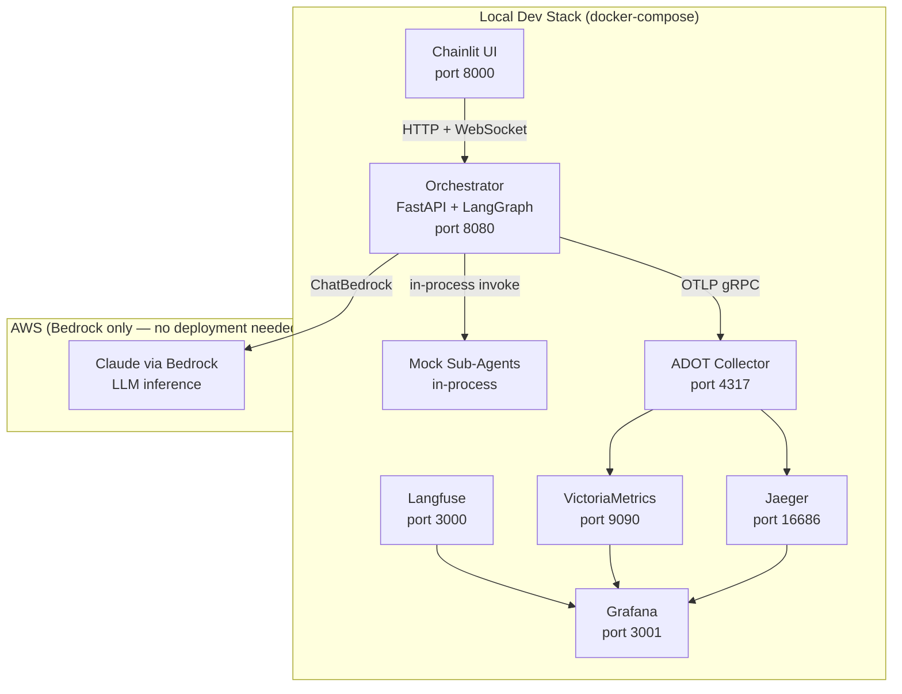
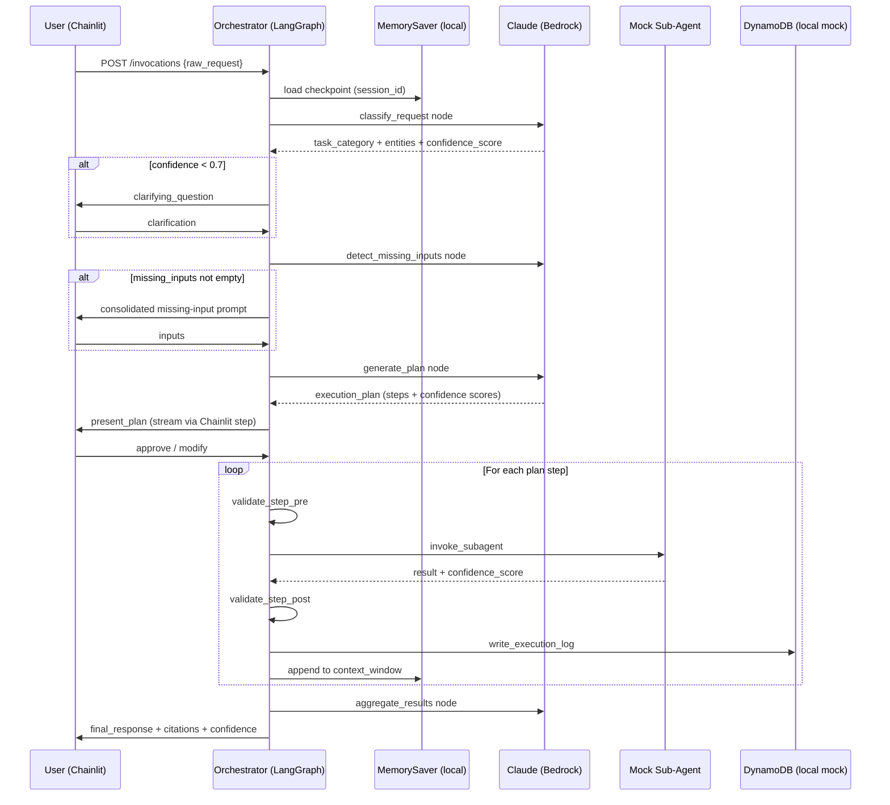

# Design Document: F01 — Core Orchestrator

> Implements: Req 1–4, 13–14, 15 (local observability only), 16, 29  
> References: [`architecture.md`](../ace-agent/architecture.md), [`vision.md`](../ace-agent/vision.md)  
> Local-only simplifications: AgentCore Memory → `MemorySaver`; AgentCore Gateway → bypassed; AgentCore Identity → disabled; Bedrock Knowledge Bases → mock retriever; Bedrock Guardrails → passthrough wrapper.

---

## Overview

F01 delivers the runnable skeleton of the AWS Cloud Engineering Agent. A developer can `docker compose up -d` and `uvicorn src.orchestrator.main:app --port 8080 --reload` to get a fully wired LangGraph `StateGraph` that accepts natural language requests, classifies intent, detects missing inputs, generates a confidence-scored execution plan, validates each step pre/post execution, invokes mock sub-agents, and streams real-time progress through a Chainlit UI — all without any AWS deployment beyond Bedrock API access for LLM inference.

The design covers the complete request lifecycle from intake through response, the full `OrchestratorState` TypedDict, every graph node and conditional edge, the Chainlit UI integration, the ADOT + Langfuse + Jaeger + VictoriaMetrics + Grafana local observability stack, and the CloudFormation foundation stacks for DynamoDB and S3 that will be used in production (F02).

---

## Architecture

### Component Diagram



### Request Lifecycle



---

## Components and Interfaces

### OrchestratorState

The single TypedDict that flows through every graph node. Defined in `src/orchestrator/graph.py`.

```python
from typing import TypedDict, List, Optional, Dict, Any

class OrchestratorState(TypedDict):
    # ── Request ──────────────────────────────────────────────────────────────
    raw_request: str
    task_category: Optional[str]          # one of 7 categories after classification
    entities: Dict[str, Any]              # extracted service names, time ranges, etc.
    confidence_score: float               # classification confidence (0.0–1.0)
    clarifying_question: Optional[str]    # set when confidence_score < 0.7

    # ── Plan ─────────────────────────────────────────────────────────────────
    execution_plan: List[Dict[str, Any]]  # ordered steps; each has confidence_score
    missing_inputs: List[Dict[str, Any]]  # unresolved required parameters
    pending_approval: bool                # waiting for user plan confirmation

    # ── Execution ────────────────────────────────────────────────────────────
    current_step_index: int
    hop_count: int                        # max 10 sequential hops enforced
    token_budget_used: int
    token_budget_limit: int
    visited_steps: List[str]             # (agent_id, inputs_hash) for cycle detection
    step_results: List[Dict[str, Any]]   # accumulated sub-agent outputs

    # ── Context ──────────────────────────────────────────────────────────────
    context_window: List[Any]            # LangChain Documents + step outputs
    session_id: str
    user_id: str

    # ── Output ───────────────────────────────────────────────────────────────
    final_response: Optional[str]
    citations: List[Dict[str, Any]]      # {title, url, timestamp}
    error: Optional[Dict[str, Any]]
```

### Graph Nodes

Each node lives in its own file under `src/orchestrator/nodes/`. All nodes are pure functions `(state: OrchestratorState) -> OrchestratorState`.

| Node file | Responsibility |
|---|---|
| `classify_request.py` | LLM call → `task_category`, `entities`, `confidence_score`; sets `clarifying_question` if confidence < 0.7 |
| `retrieve_knowledge.py` | Local: mock retriever returning 2–3 fixture documents (with title, url, content) so property 21 is testable; prod: `AmazonKnowledgeBasesRetriever` top-5 |
| `detect_missing_inputs.py` | LLM call → populates `missing_inputs` list from plan step schemas |
| `prompt_user.py` | Consolidates all `missing_inputs` into one prompt; waits for user response via Chainlit |
| `generate_plan.py` | LLM call → `execution_plan` with per-step `confidence_score`; flags steps < 0.75 |
| `present_plan.py` | Streams plan to Chainlit; sets `pending_approval = True`; waits for user confirm/modify |
| `validate_step_pre.py` | Checks inputs present, sub-agent available, action within allowed set |
| `invoke_subagent.py` | Selects sub-agent from registry; invokes; enforces 120s timeout; handles retry |
| `validate_step_post.py` | Checks output schema, confidence threshold; triggers retry (max 2) or escalate |
| `aggregate_results.py` | LLM call → unified response; cross-references ≥2 sources by comparing retrieved KB fixture documents against sub-agent outputs; computes final confidence; flags uncertainty when < 0.8; flags output as "unverified against current state" when no live sub-agent data was used (Req 14.3); surfaces contradictions between KB docs and sub-agent results to user |
| `scan_output_guardrails.py` | Local: passthrough; prod: `ChatBedrock` with `guardrailConfig` on output |
| `write_execution_log.py` | Writes immutable entry to `execution-logs` DynamoDB table via `src/storage/dynamodb.py` |

### Conditional Edges

```mermaid
graph LR
    classify_request -->|confidence >= 0.7| retrieve_knowledge
    classify_request -->|confidence < 0.7| prompt_user
    prompt_user -->|clarification received| classify_request
    retrieve_knowledge --> detect_missing_inputs
    detect_missing_inputs -->|missing_inputs empty| generate_plan
    detect_missing_inputs -->|missing_inputs not empty| prompt_user
    generate_plan --> present_plan
    present_plan -->|approved| validate_step_pre
    present_plan -->|modified| generate_plan
    validate_step_pre -->|valid| invoke_subagent
    validate_step_pre -->|invalid| aggregate_results
    invoke_subagent --> validate_step_post
    validate_step_post -->|pass, more steps| validate_step_pre
    validate_step_post -->|pass, done| aggregate_results
    validate_step_post -->|fail, retries < 2| invoke_subagent
    validate_step_post -->|fail, retries exhausted| aggregate_results
    aggregate_results --> scan_output_guardrails
    scan_output_guardrails --> write_execution_log
    write_execution_log --> END
```



**Safety edges** (checked at every `invoke_subagent` entry):
- `hop_count >= 10` → route to `aggregate_results` with diagnostic error
- cycle detected (`(agent_id, inputs_hash)` already in `visited_steps`) → route to `aggregate_results`
- `token_budget_used >= token_budget_limit` → route to `aggregate_results` with budget-exceeded error

**Parallel execution:** Independent plan steps (where no step's `tool_inputs` reference outputs from a prior step) are dispatched concurrently using LangGraph's `Send` API, capped at 5 concurrent sub-agent invocations per request (Req 4.5). The graph detects dependencies by checking whether a step's inputs reference `step_results` from prior steps.

### FastAPI Entrypoint (`src/orchestrator/main.py`)

```python
from fastapi import FastAPI
from pydantic import BaseModel

app = FastAPI()

class InvocationRequest(BaseModel):
    raw_request: str
    session_id: str
    user_id: str = "local-user"

@app.get("/ping")
async def ping():
    return {"status": "Healthy"}

@app.post("/invocations")
async def invocations(req: InvocationRequest):
    # compile graph with MemorySaver checkpointer (local)
    # ainvoke with thread_id=session_id
    ...
```

### Memory (`src/orchestrator/memory.py`)

```python
import os
from langgraph.checkpoint.memory import MemorySaver

def get_checkpointer():
    """
    Returns MemorySaver locally (AGENTCORE_MEMORY_STORE_ID unset).
    Returns AgentCoreMemorySaver in production (F02+).
    """
    if os.getenv("AGENTCORE_MEMORY_STORE_ID"):
        from langgraph_checkpoint_aws import AgentCoreMemorySaver
        return AgentCoreMemorySaver(...)
    return MemorySaver()
```

### Prompt Templates (`src/orchestrator/prompts.py`)

```python
from langchain_core.prompts import ChatPromptTemplate
from src.storage.dynamodb import get_item

def load_prompt_template(task_category: str, version: str = "active") -> ChatPromptTemplate:
    """
    Loads versioned Prompt_Template from prompt-template-registry DynamoDB.
    Falls back to local mock templates when MOCK_PROMPTS=true (local dev).
    """
    ...
```

### Chainlit UI (`src/ui/`)

**`app.py`** — entrypoint with `@cl.on_chat_start` and `@cl.on_message`:

```python
import chainlit as cl
from src.ui.handlers import ChainlitStepHandler

@cl.on_chat_start
async def on_chat_start():
    cl.user_session.set("session_id", str(uuid4()))

@cl.on_message
async def on_message(message: cl.Message):
    handler = ChainlitStepHandler()
    # invoke orchestrator graph with callbacks=[handler]
    ...
```

**`handlers.py`** — `ChainlitStepHandler(BaseCallbackHandler)`:
- `on_chain_start` → opens a `cl.Step` named after the LangGraph node
- `on_tool_start` → streams tool name + inputs into the current step
- `on_chain_end` → closes the step with status

**`renderers.py`** — structured output helpers:
- `render_plan(plan)` → collapsible markdown list with confidence badges
- `render_citations(citations)` → inline `[title](url)` links
- `render_confidence(score)` → `🟢 High` / `🟡 Medium` / `🔴 Low` badge

**`auth.py`** — local: no-op (Chainlit auth disabled when `CHAINLIT_AUTH_SECRET` unset); prod: OAuth callback to AgentCore Identity.

### Observability (`src/observability/`)

**`otel.py`** — ADOT TracerProvider setup:

```python
from opentelemetry.sdk.trace import TracerProvider
from opentelemetry.sdk.extension.aws.trace import AwsXRayIdGenerator
from opentelemetry.exporter.otlp.proto.grpc.trace_exporter import OTLPSpanExporter

def init_tracer():
    provider = TracerProvider(id_generator=AwsXRayIdGenerator())
    exporter = OTLPSpanExporter(
        endpoint=os.getenv("OTEL_EXPORTER_OTLP_ENDPOINT", "http://localhost:4317")
    )
    provider.add_span_processor(BatchSpanProcessor(exporter))
    trace.set_tracer_provider(provider)
```

**`langfuse.py`** — conditional CallbackHandler factory:

```python
import os

def get_langfuse_handler():
    """Returns CallbackHandler when OTEL_STACK=local, else None."""
    if os.getenv("OTEL_STACK") == "local":
        from langfuse.langchain import CallbackHandler
        return CallbackHandler(
            public_key=os.getenv("LANGFUSE_PUBLIC_KEY"),
            secret_key=os.getenv("LANGFUSE_SECRET_KEY"),
            host=os.getenv("LANGFUSE_BASE_URL", "http://localhost:3000"),
        )
    return None
```

### Storage Helpers

**`src/storage/dynamodb.py`** — thin wrappers over `boto3` DynamoDB resource. All 7 tables accessed exclusively through these helpers — no direct `boto3` client instantiation in agent code.

**`src/storage/s3.py`** — thin wrappers over `boto3` S3 client for the 3 buckets.

### Mock Sub-Agents (`src/agents/mock/`)

For F01, all sub-agents are mocked in-process. Each mock implements the standard sub-agent interface:

```python
# src/agents/mock/agent.py
class MockSubAgent:
    """
    Returns a canned response with confidence_score=0.85.
    Registered in subagent-registry with all 6 categories for local testing.
    """
    def invoke(self, task: str, context_window: list, tool_inputs: dict) -> dict:
        return {
            "result": f"[MOCK] Completed: {task}",
            "confidence_score": 0.85,
            "sources": [{"title": "Mock Source", "url": "http://mock", "timestamp": "..."}],
            "error": None,
        }
```

---

## Data Models

### Execution Plan Step

```python
class PlanStep(TypedDict):
    step_index: int
    description: str
    expected_category: str          # one of 6 integration categories
    required_capability: str        # matched against capabilityDescriptor
    agent_id: Optional[str]         # resolved at routing time
    tool_name: str
    tool_inputs: Dict[str, Any]
    expected_output_schema: Dict    # JSON Schema
    confidence_score: float
    is_flagged: bool                # True when confidence_score < 0.75
    flag_rationale: Optional[str]
    requires_approval: bool         # True for destructive actions
```

### Execution Log Entry

Written to `execution-logs` DynamoDB table by `write_execution_log` node:

```python
class ExecutionLogEntry(TypedDict):
    requestId: str                  # PK
    stepTimestamp: str              # SK (ISO-8601)
    stepIndex: int
    subAgent: str
    tool: str
    toolInputs: Dict                # redacted by guardrails before write
    toolOutput: Dict
    validationResult: str           # PASS | FAIL | RETRY
    confidenceScore: float
    errorMessage: Optional[str]
    tokenCount: int
    promptTemplateId: str           # Req 16.2
    promptTemplateVersion: str
    ttl: int                        # Unix epoch, 90-day expiry
```

---

## Error Handling

| Scenario | Node | Behaviour |
|---|---|---|
| Classification confidence < 0.7 | `classify_request` | Sets `clarifying_question`; routes to `prompt_user` |
| Missing required input | `detect_missing_inputs` | Populates `missing_inputs`; routes to `prompt_user` |
| Invalid missing-input response | `prompt_user` | Re-prompts with validation error + example |
| Pre-validation failure | `validate_step_pre` | Skips step; logs error; routes to `aggregate_results` |
| Sub-agent timeout (>120s) | `invoke_subagent` | Cancels invocation; marks step failed; continues |
| Post-validation failure | `validate_step_post` | Retries up to 2× with enriched context; then escalates |
| Hop limit reached (10) | edge check | Halts; returns diagnostic error to user |
| Cycle detected | edge check | Halts; returns cycle-detection diagnostic |
| Token budget exceeded | edge check | Halts; notifies user of budget condition |
| Destructive action in plan | `present_plan` | Forces explicit user confirmation regardless of config |
| Low-confidence final answer (<0.8) | `aggregate_results` | Surfaces uncertainty + reason explicitly to user |

---

## Testing Strategy

### Unit Testing Approach

Each graph node is a pure function and can be tested in isolation by constructing a minimal `OrchestratorState` dict and asserting on the returned state. No LangGraph runtime required for unit tests.

```python
# tests/unit/nodes/test_classify_request.py
def test_low_confidence_sets_clarifying_question(mock_llm):
    state = minimal_state(raw_request="do the thing")
    mock_llm.return_value = ClassifyResult(confidence_score=0.5, ...)
    result = classify_request(state)
    assert result["clarifying_question"] is not None
    assert result["task_category"] is None
```

### Property-Based Testing Approach

**Property Test Library**: `hypothesis`

Key properties to verify:

1. `∀ state: confidence_score ∈ [0.0, 1.0]` — classification always returns a valid score
2. `∀ plan: all(step["confidence_score"] ∈ [0.0, 1.0] for step in plan)` — plan steps always have valid scores
3. `∀ state with hop_count >= 10: graph routes to aggregate_results` — hop limit always enforced
4. `∀ state with cycle detected: graph halts` — cycle detection always fires
5. `∀ execution: len(execution_log_entries) == len(completed_steps)` — every completed step has a log entry
6. `∀ missing_inputs not empty: execution does not proceed` — missing inputs always block execution
7. `∀ post_validation_failure: retry_count <= 2` — retry cap always respected

### Integration Testing Approach

Full graph integration tests use the compiled `StateGraph` with `MemorySaver` and mock LLM responses. Tests verify end-to-end state transitions across the full node sequence.

---

## Performance Considerations

- Graph nodes that are independent (e.g., parallel plan steps) use LangGraph's `Send` API for fan-out, capped at 5 concurrent sub-agent invocations per request (Req 4.5).
- `MemorySaver` checkpoints are in-memory for F01 — no serialization overhead locally.
- Prompt templates are cached in-process after first DynamoDB load to avoid per-request table reads.
- ADOT spans are batched via `BatchSpanProcessor` — no synchronous export on the hot path.

---

## Security Considerations

- No AWS credentials required locally except `AWS_PROFILE` for Bedrock API calls.
- `CHAINLIT_AUTH_SECRET` unset → auth disabled locally; must be set in production.
- `AGENTCORE_GATEWAY_ENDPOINT` unset → sub-agents called directly (mock); in production all calls go through Gateway.
- All tool inputs are redacted before writing to `execution-logs` (guardrails passthrough in F01; full Bedrock Guardrails in F02+).
- Each mock sub-agent has a defined `allowedActions` list enforced by `validate_step_pre` — the permission model is live from day one even with mocks.

---

## Dependencies

| Package | Version constraint | Purpose |
|---|---|---|
| `langgraph` | `>=0.2` | `StateGraph`, `MemorySaver`, `Send` |
| `langchain-aws` | `>=0.2` | `ChatBedrock` |
| `langchain-core` | `>=0.3` | `BaseTool`, `ChatPromptTemplate`, `BaseCallbackHandler` |
| `fastapi` | `>=0.111` | `/invocations`, `/ping` |
| `uvicorn` | `>=0.29` | ASGI server |
| `chainlit` | `>=1.1` | Chat UI + LangGraph callback integration |
| `opentelemetry-sdk` | `>=1.24` | TracerProvider, MeterProvider |
| `opentelemetry-sdk-extension-aws` | `>=2.0` | `AwsXRayIdGenerator` |
| `opentelemetry-propagator-aws-xray` | `>=1.0` | X-Ray propagator |
| `opentelemetry-exporter-otlp-proto-grpc` | `>=1.24` | OTLP gRPC exporter → ADOT Collector |
| `langfuse` | `>=3.0` | `langfuse.langchain.CallbackHandler` (local only) |
| `boto3` | `>=1.34` | DynamoDB + S3 access via storage helpers |
| `pydantic` | `>=2.0` | Request/response models |
| `hypothesis` | `>=6.0` | Property-based tests |
| `pytest` | `>=8.0` | Test runner |
| `pytest-asyncio` | `>=0.23` | Async test support |

---

## docker-compose.yml Local Stack

Services included:

| Service | Image | Port | Purpose |
|---|---|---|---|
| `orchestrator` | `./src/orchestrator` (ARM64) | 8080 | Orchestrator FastAPI app |
| `chainlit` | `./src/ui` (ARM64) | 8000 | Chat UI — connects to orchestrator via `ORCHESTRATOR_URL=http://orchestrator:8080` |
| `adot-collector` | `amazon/aws-otel-collector` | 4317 (gRPC), 4318 (HTTP) | Receives OTLP; routes to Jaeger + VictoriaMetrics |
| `jaeger` | `jaegertracing/all-in-one` | 16686 | Trace UI |
| `langfuse` | `langfuse/langfuse` | 3000 | LLM trace capture |
| `langfuse-db` | `postgres:15` | 5432 | PostgreSQL backend for Langfuse |
| `victoriametrics` | `victoriametrics/victoria-metrics` | 9090 | Metrics backend (Prometheus-compatible) |
| `grafana` | `grafana/grafana` | 3001 | Dashboards (pre-wired to Jaeger + Langfuse + VictoriaMetrics) |

ADOT Collector config routes:
- Traces → Jaeger (local) via `jaeger` exporter
- Metrics → VictoriaMetrics via `prometheusremotewrite` exporter
- W3C TraceContext propagation (not X-Ray) in local mode

---

## CloudFormation Foundation Stacks (F01 scope)

F01 creates the CloudFormation templates for the foundation data and storage stacks. These are not deployed in F01 (that's F02) but are authored and validated with `cfn-lint` so they're ready.

### `cloudformation/stacks/foundation/data.yaml`

Provisions all 7 DynamoDB tables with:
- On-demand billing
- PITR enabled
- KMS encryption
- TTL on `execution-logs` and `guardrail-violations`
- DynamoDB Streams on `eval-run-results`
- GSIs as defined in architecture data models

### `cloudformation/stacks/foundation/storage.yaml`

Provisions all 3 S3 buckets with:
- KMS server-side encryption
- Public access blocked
- VPC-only bucket policy
- S3 Versioning on `golden-dataset`
- Glue Data Catalog table over `eval-results` (partitioned by year/month/taskCategory)
- Athena workgroup

### `cloudformation/parameters/local.json`

```json
{
  "Environment": "local",
  "OtelExporterEndpoint": "http://localhost:4317",
  "MockSubAgents": "true",
  "TokenBudgetLimit": "50000"
}
```

### `cloudformation/parameters/production.json`

```json
{
  "Environment": "production",
  "VpcId": "<REPLACE>",
  "SubnetIds": "<REPLACE>",
  "OtelExporterEndpoint": "<agentcore-observability-endpoint>",
  "MockSubAgents": "false",
  "TokenBudgetLimit": "200000"
}
```

---

## Correctness Properties (Req 1–4, 13–14, 15, 16, 29)

All 23 properties listed below are testable locally with mock sub-agents and `MemorySaver`.

### Classification (Req 1)

1. `∀ request: task_category ∈ {incident_investigation, infrastructure_change, cost_analysis, deployment, monitoring_query, knowledge_retrieval, code_review}`
2. `∀ request: confidence_score ∈ [0.0, 1.0]`
3. `∀ request with confidence_score < 0.7: clarifying_question is not None`
4. `∀ request with confidence_score >= 0.7: clarifying_question is None`

### Plan Generation (Req 2)

5. `∀ plan: len(execution_plan) >= 1`
6. `∀ step in plan: step["confidence_score"] ∈ [0.0, 1.0]`
7. `∀ step with confidence_score < 0.75: step["is_flagged"] == True and step["flag_rationale"] is not None`
8. `∀ plan: plan is presented to user before any step executes`

### Missing Inputs (Req 3)

9. `∀ state with missing_inputs not empty: no step executes until all inputs resolved`
10. `∀ missing inputs: all consolidated into single prompt (not asked one-at-a-time mid-execution)`
11. `∀ invalid missing-input response: re-prompt issued with validation error + example`

### Orchestration (Req 4)

12. `∀ execution: hop_count never exceeds 10`
13. `∀ execution: cycle detection fires when (agent_id, inputs_hash) repeats`
14. `∀ execution: token_budget_used tracked and halts when >= token_budget_limit`
15. `∀ independent steps: executed in parallel (max 5 concurrent)`

### Step Validation (Req 13)

16. `∀ step: validate_step_pre runs before invoke_subagent`
17. `∀ step: validate_step_post runs after invoke_subagent`
18. `∀ post-validation failure: retry_count <= 2`
19. `∀ completed step: exactly one execution-log entry written`

### Output Quality (Req 14)

20. `∀ final_response with confidence_score < 0.8: uncertainty explicitly stated`
21. `∀ final_response: citations list is non-empty when KB documents were used`

### Prompt Templates (Req 16)

22. `∀ LLM invocation: prompt_template_id and prompt_template_version recorded in execution log`
23. `∀ rendered prompt: no unresolved placeholder variables`
