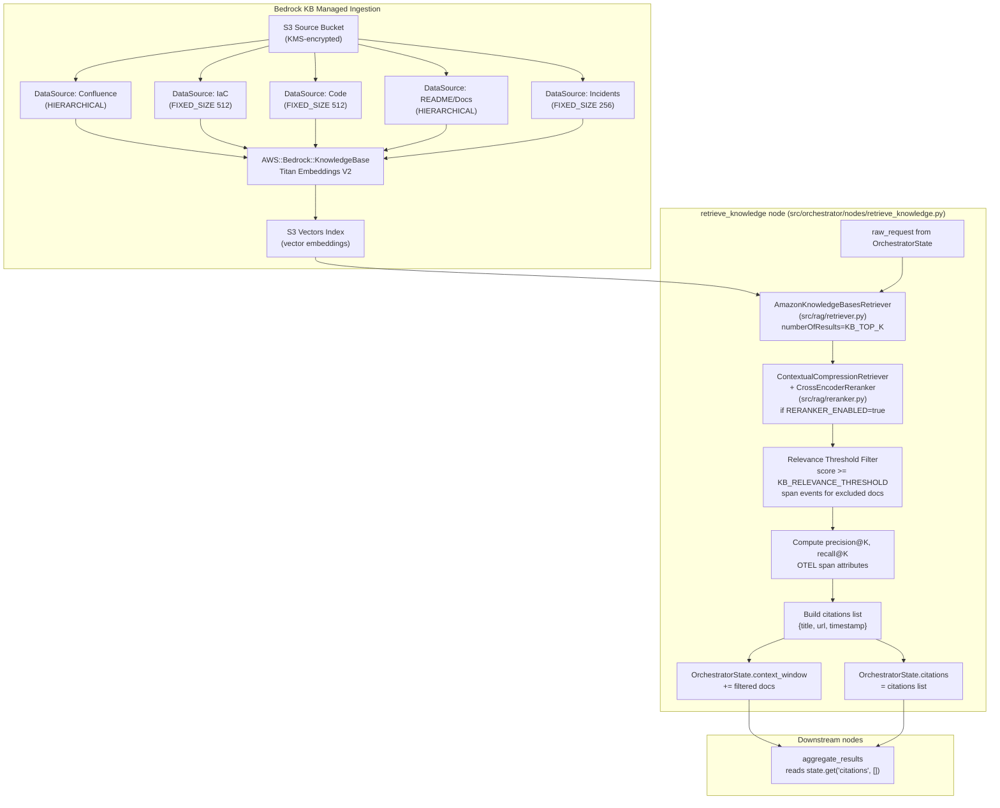

# Design: F03 — Knowledge & RAG

## Overview

F03 makes the Orchestrator knowledge-grounded by wiring a real Amazon Bedrock Knowledge Base into the `retrieve_knowledge` LangGraph node. It delivers three things:

1. **Infrastructure** — `cloudformation/stacks/platform/knowledge.yaml` provisions the Bedrock KB, S3 source bucket (KMS-encrypted), S3 Vectors index, and the IAM role the KB service needs to read from S3 and write to the vector index.
2. **Python RAG pipeline** — `src/rag/retriever.py` and `src/rag/reranker.py` are implemented; `src/orchestrator/nodes/retrieve_knowledge.py` is fully rewritten to use them, with OTEL tracing, relevance threshold filtering, citation building, and RAG metrics.
3. **Targeted fixes** — `src/orchestrator/nodes/aggregate_results.py` is updated to read citations from `state["citations"]` (populated by `retrieve_knowledge`) instead of rebuilding them from `context_window`, and to surface KB retrieval errors in the final response.

**What F03 does NOT touch:**
- Graph topology in `src/orchestrator/graph.py` — `retrieve_knowledge` is already wired before `detect_missing_inputs`; no edge changes needed.
- `OrchestratorState` schema in `graph.py` — `context_window`, `citations`, and `error` fields already exist.
- Document ingestion tooling — documents are placed in the S3 source bucket manually or via external pipelines; F03 only provisions the infrastructure.
- Offline RAGAS evaluation — deferred to F09.
- Production observability dashboards — deferred to F05.


## Architecture




## Infrastructure Design

### `cloudformation/stacks/platform/knowledge.yaml`

Follows the same structure as `memory.yaml` and `guardrails.yaml`: `Parameters` (Environment, Application), tagged resources, SSM parameters, and cross-stack `Outputs` with `Export: Name: !Sub "${AWS::StackName}-<ResourceName>"`.

#### Parameters

| Parameter | Type | Default | Purpose |
|---|---|---|---|
| `Environment` | String (local/dev/prod) | — | Deployment environment |
| `Application` | String | `ace-agent` | Resource naming and tagging |

#### Resources

**KMS Key — `KnowledgeSourceBucketKmsKey`**
- `Type: AWS::KMS::Key`
- `DeletionPolicy: Retain` / `UpdateReplacePolicy: Retain`
- `EnableKeyRotation: true`
- Key policy: root account full access + `s3.amazonaws.com` allowed `kms:GenerateDataKey` / `kms:Decrypt`
- Alias: `alias/${Application}-${Environment}-knowledge-source`

**S3 Source Bucket — `KnowledgeSourceBucket`**
- `Type: AWS::S3::Bucket`
- `DeletionPolicy: Retain` / `UpdateReplacePolicy: Retain`
- `BucketEncryption`: SSEAlgorithm `aws:kms`, KMSMasterKeyID `!Ref KnowledgeSourceBucketKmsKey`
- `PublicAccessBlockConfiguration`: all four flags `true`
- `VersioningConfiguration`: `Status: Enabled`
- `BucketName`: `!Sub "${Application}-${Environment}-knowledge-source-${AWS::AccountId}"`

**S3 Vectors Index — `KnowledgeVectorsIndex`**
- `Type: AWS::S3Vectors::VectorBucket` (or the correct CFN resource type for S3 Vectors)
- `DeletionPolicy: Retain` / `UpdateReplacePolicy: Retain`
- Dimension: 1024 (Titan Embeddings V2 output dimension)
- Distance metric: cosine

**Bedrock KB IAM Role — `BedrockKbServiceRole`**
- `Type: AWS::IAM::Role`
- Trust policy: `bedrock.amazonaws.com` can `sts:AssumeRole`
- Inline policy `BedrockKbPolicy`:
  - `s3:GetObject`, `s3:ListBucket` on `KnowledgeSourceBucket` and `KnowledgeSourceBucket/*`
  - `bedrock:InvokeModel` on the Titan Embeddings V2 foundation model ARN (`arn:${AWS::Partition}:bedrock:${AWS::Region}::foundation-model/amazon.titan-embed-text-v2:0`) — required for the KB service to generate vector embeddings during ingestion
  - `s3vectors:*` on `KnowledgeVectorsIndex` ARN
  - `kms:Decrypt`, `kms:GenerateDataKey` on `KnowledgeSourceBucketKmsKey`

**Bedrock Knowledge Base — `KnowledgeBase`**
- `Type: AWS::Bedrock::KnowledgeBase`
- `KnowledgeBaseConfiguration`:
  - `Type: VECTOR`
  - `VectorKnowledgeBaseConfiguration`:
    - `EmbeddingModelArn`: `arn:aws:bedrock:${AWS::Region}::foundation-model/amazon.titan-embed-text-v2:0`
- `StorageConfiguration`:
  - `Type: S3_VECTORS`
  - `S3VectorsConfiguration`: references `KnowledgeVectorsIndex`
- `RoleArn`: `!GetAtt BedrockKbServiceRole.Arn`

**Data Sources — one per document type category**

Each `AWS::Bedrock::DataSource` is attached to `!Ref KnowledgeBase` with `DataSourceConfiguration.S3Configuration.BucketArn: !GetAtt KnowledgeSourceBucket.Arn` and a distinct S3 prefix. The `VectorIngestionConfiguration.ChunkingConfiguration` differs per source. All data sources share the same sync schedule: `ScheduleExpression: rate(60 minutes)` on the `DataSourceConfiguration` to meet the 1-hour indexing SLA from Req 3.1–3.2.

**Service limit**: Bedrock KB supports a maximum of 5 data sources per Knowledge Base. The original design included a 6th `DataSourceDefault` (`default/` prefix, `FIXED_SIZE` 512/64) but it was removed to stay within the limit. Miscellaneous documents should be placed in the most appropriate existing prefix.

| Resource | S3 Prefix | ChunkingStrategy | Config |
|---|---|---|---|
| `DataSourceConfluence` | `confluence/` | `HIERARCHICAL` | parent 1500, child 300, overlap 60 |
| `DataSourceIaC` | `iac/` | `FIXED_SIZE` | 512 tokens, 64 overlap |
| `DataSourceCode` | `code/` | `FIXED_SIZE` | 512 tokens, 64 overlap |
| `DataSourceReadme` | `readme/` | `HIERARCHICAL` | parent 1500, child 300, overlap 60 |
| `DataSourceIncidents` | `incidents/` | `FIXED_SIZE` | 256 tokens, 32 overlap |

> **Note:** Bedrock KB enforces a limit of 5 data sources per knowledge base. `DataSourceDefault` was removed to stay within this limit. Miscellaneous documents that don't fit the above categories should be placed under any of the existing prefixes (e.g. `default/` docs → `confluence/` or `readme/` depending on content type).

**SSM Parameter — `KnowledgeBaseIdParam`**
- Path: `/${Application}/${Environment}/knowledge/knowledge-base-id`
- Value: `!GetAtt KnowledgeBase.KnowledgeBaseId`

#### Outputs

| Export Name | Value | Description |
|---|---|---|
| `${AWS::StackName}-KnowledgeBaseId` | `!GetAtt KnowledgeBase.KnowledgeBaseId` | Imported by orchestrator.yaml as `KNOWLEDGE_BASE_ID` |
| `${AWS::StackName}-KnowledgeBaseArn` | `!GetAtt KnowledgeBase.KnowledgeBaseArn` | Imported by identity.yaml to scope IAM policy |
| `${AWS::StackName}-KnowledgeSourceBucketKmsKeyArn` | `!GetAtt KnowledgeSourceBucketKmsKey.Arn` | For audit and cross-stack KMS grants |

### Changes to `cloudformation/stacks/foundation/identity.yaml`

Add `KnowledgeStackName` parameter (alongside existing `NetworkingStackName`, etc.):

```yaml
KnowledgeStackName:
  Type: String
  Default: ace-agent-platform-knowledge-prod
  Description: Name of the deployed knowledge stack. Used to scope bedrock-agent-runtime:Retrieve.
```

Add `AllowKnowledgeBaseRetrieve` statement to `OrchestratorPolicy`:

```yaml
- Sid: AllowKnowledgeBaseRetrieve
  Effect: Allow
  Action:
    - bedrock-agent-runtime:Retrieve
  Resource:
    - Fn::ImportValue: !Sub "${KnowledgeStackName}-KnowledgeBaseArn"
```

### Changes to `cloudformation/stacks/application/agents/orchestrator.yaml`

Add `KnowledgeStackName`, `KB_TOP_K`, `KB_RELEVANCE_THRESHOLD`, `RERANKER_ENABLED` parameters:

```yaml
KnowledgeStackName:
  Type: String
  Default: ace-agent-platform-knowledge-prod

KB_TOP_K:
  Type: String
  Default: "5"

KB_RELEVANCE_THRESHOLD:
  Type: String
  Default: "0.5"

RERANKER_ENABLED:
  Type: String
  Default: "true"
  AllowedValues: ["true", "false"]
```

Add to `EnvironmentVariables` on `OrchestratorRuntimeEndpoint`:

```yaml
KNOWLEDGE_BASE_ID:
  Fn::ImportValue: !Sub "${KnowledgeStackName}-KnowledgeBaseId"
KB_TOP_K: !Ref KB_TOP_K
KB_RELEVANCE_THRESHOLD: !Ref KB_RELEVANCE_THRESHOLD
RERANKER_ENABLED: !Ref RERANKER_ENABLED
```


## Components and Interfaces

### `src/rag/retriever.py`

Per Req 5.5, `retriever.py` is the single import point for the `retrieve_knowledge` node — it imports `build_reranker` from `src.rag.reranker` and applies it when `reranker_enabled=True`. The node never imports from `src.rag.reranker` directly.

```python
from langchain_aws import AmazonKnowledgeBasesRetriever
from langchain_core.retrievers import BaseRetriever

def build_kb_retriever(
    knowledge_base_id: str,
    top_k: int = 5,
    metadata_filter: dict | None = None,
    reranker_enabled: bool = True,
) -> BaseRetriever:
    """
    Returns a retriever for the given KB ID.

    When reranker_enabled=True, wraps AmazonKnowledgeBasesRetriever in a
    ContextualCompressionRetriever (CrossEncoderReranker) via build_reranker()
    from src.rag.reranker. The retrieve_knowledge node imports only this
    function — never src.rag.reranker directly (Req 5.5).

    metadata_filter is passed as filter inside vectorSearchConfiguration.
    No boto3 clients are instantiated directly.
    """
    retrieval_config: dict = {
        "vectorSearchConfiguration": {"numberOfResults": top_k}
    }
    if metadata_filter:
        retrieval_config["vectorSearchConfiguration"]["filter"] = metadata_filter

    base_retriever = AmazonKnowledgeBasesRetriever(
        knowledge_base_id=knowledge_base_id,
        retrieval_config=retrieval_config,
    )

    if reranker_enabled:
        from src.rag.reranker import build_reranker
        return build_reranker(base_retriever)

    return base_retriever
```

### `src/rag/reranker.py`

```python
from langchain.retrievers import ContextualCompressionRetriever
from langchain.retrievers.document_compressors import CrossEncoderReranker
from langchain_core.retrievers import BaseRetriever

_MODEL_NAME = "cross-encoder/ms-marco-MiniLM-L-6-v2"

def build_reranker(base_retriever: BaseRetriever) -> ContextualCompressionRetriever:
    """
    Wraps base_retriever in a ContextualCompressionRetriever backed by a
    CrossEncoderReranker using cross-encoder/ms-marco-MiniLM-L-6-v2.

    Requires sentence-transformers in pyproject.toml dependencies.
    Returns a retriever whose .invoke(query) returns documents sorted by
    descending cross-encoder relevance score.
    """
    compressor = CrossEncoderReranker(model_name=_MODEL_NAME, top_n=None)
    return ContextualCompressionRetriever(
        base_compressor=compressor,
        base_retriever=base_retriever,
    )
```

### `src/orchestrator/nodes/retrieve_knowledge.py` — full rewrite

Key responsibilities:
1. Read env vars: `KNOWLEDGE_BASE_ID`, `KB_TOP_K` (int, default 5), `KB_RELEVANCE_THRESHOLD` (float, default 0.5), `RERANKER_ENABLED` (bool, default true).
2. Open OTEL span `knowledge.retrieve` via `opentelemetry.trace.get_tracer(__name__)`.
3. When `KNOWLEDGE_BASE_ID` is set:
   - Call `build_kb_retriever(knowledge_base_id, top_k)` from `src.rag.retriever`. Note: per Req 5.5, `build_kb_retriever` in `src/rag/retriever.py` is responsible for optionally wrapping the base retriever with the reranker — the `retrieve_knowledge` node imports only from `src.rag.retriever`, not directly from `src.rag.reranker`. `retriever.py` imports `build_reranker` from `src.rag.reranker` and applies it when `RERANKER_ENABLED=true`.
   - If `RERANKER_ENABLED`: `build_kb_retriever` returns a `ContextualCompressionRetriever` (reranker-wrapped); if `false`, returns a plain `AmazonKnowledgeBasesRetriever`. The node calls `.invoke(query)` on whichever retriever is returned → `docs`.
   - If not `RERANKER_ENABLED`: call `kb_retriever.invoke(query)` → `docs` (no scores).
   - Apply threshold filter: keep only docs where `doc.metadata.get("relevance_score", 1.0) >= threshold`. Emit a span event for each excluded doc with `doc_id` and `score`.
   - Compute `precision@K` and `recall@K` from scores (see Data Models).
   - Build `citations` list from `doc.metadata` with fallback to S3 key.
   - Set span attributes (see below).
   - On any exception: set `state["error"] = {"type": ..., "message": ...}`, emit span event, do NOT fall back to fixtures.
4. When `KNOWLEDGE_BASE_ID` is not set: use `FIXTURE_DOCS`, skip threshold, set metrics to `None`.
5. When `OTEL_STACK=local`: pass `get_langfuse_handler()` via `config={"callbacks": [handler]}` on the retriever `.invoke()` call.
6. Return `{**state, "context_window": [...], "citations": [...]}` or `{**state, "error": {...}}`.

OTEL span attributes set on `knowledge.retrieve`:

| Attribute | Value |
|---|---|
| `rag.query_hash` | `hashlib.sha256(query.encode()).hexdigest()[:16]` |
| `rag.k` | `top_k` |
| `rag.docs_retrieved` | count before threshold |
| `rag.docs_included` | count after threshold |
| `rag.reranker_applied` | bool |
| `rag.precision_at_k` | float or `None` |
| `rag.recall_at_k` | float or `None` |

### `src/orchestrator/nodes/aggregate_results.py` — targeted changes only

Two changes, nothing else:

1. Replace the citation-building loop (lines that iterate `context_window`) with:
   ```python
   citations = state.get("citations", [])
   ```

2. Add error detection before the LLM call:
   ```python
   if state.get("error"):
       err = state["error"]
       diagnostic = (
           f"⚠️ Knowledge retrieval failed ({err.get('type', 'unknown')}): "
           f"{err.get('message', '')}. "
           "The plan below may be less accurate — no KB context was available."
       )
       # prepend diagnostic to final_response after it is built
   ```
   The diagnostic is prepended to `final_response` after the LLM call (or mock path) completes.


## Data Models

### Citation

Matches the existing `OrchestratorState.citations: List[Dict[str, Any]]` schema in `graph.py`:

```python
{
    "title": str,   # doc.metadata.get("title") or S3 key fallback
    "url": str,     # doc.metadata.get("url") or S3 key fallback
    "timestamp": str,  # UTC ISO-8601 at time of retrieve_knowledge call
}
```

The `timestamp` is captured once at the start of the `retrieve_knowledge` node call (not at `aggregate_results` time, fixing the existing bug in `aggregate_results.py`).

### RAG Metrics Computation

Given:
- `scored_docs`: list of `(Document, float)` pairs from the reranker, ordered by descending score
- `threshold`: `KB_RELEVANCE_THRESHOLD` (float)
- `K`: `KB_TOP_K` (int)

```python
relevant_in_top_k = sum(1 for _, score in scored_docs[:K] if score >= threshold)
total_relevant = sum(1 for _, score in scored_docs if score >= threshold)

precision_at_k = relevant_in_top_k / K if K > 0 else 0.0
recall_at_k = relevant_in_top_k / total_relevant if total_relevant > 0 else 0.0
```

When `RERANKER_ENABLED=false`: `precision_at_k = None`, `recall_at_k = None`.

### Exclusion Log Entry (OTEL span event)

Emitted via `span.add_event("doc_excluded", attributes={...})` for each excluded document:

```python
{
    "doc_id": doc.metadata.get("source", doc.metadata.get("url", "unknown")),
    "score": float(score),
    "threshold": float(threshold),
}
```

When all docs are excluded, an additional event is emitted:
```python
span.add_event("all_docs_excluded", attributes={"threshold": threshold, "docs_retrieved": len(scored_docs)})
```


## Correctness Properties

*A property is a characteristic or behavior that should hold true across all valid executions of a system — essentially, a formal statement about what the system should do. Properties serve as the bridge between human-readable specifications and machine-verifiable correctness guarantees.*

### Property 11: Context Window Monotonic Growth

*For any* initial `context_window` and any set of documents returned by the KB retriever (after threshold filtering), the `context_window` in the returned state SHALL be a superset of the initial `context_window` — no previously present document SHALL be absent from the output.

**Validates: Requirements 9.2, 9.3, 9.4**

### Property 18: Citation Completeness for Every Retrieved Document

*For any* set of documents returned by the KB retriever and included in the context window (score >= threshold), the `citations` list in the returned state SHALL contain exactly one citation per included document, and each citation SHALL have a non-empty `title`, a non-empty `url` (falling back to the S3 key when metadata lacks a `url` field), and a non-empty `timestamp` in UTC ISO-8601 format.

**Validates: Requirements 8.1, 8.2, 8.3, 8.4**

### Property 24: RAG Metric Computation Correctness

*For any* list of `(Document, score)` pairs, threshold value, and K value, the computed `precision@K` SHALL equal `(count of docs in top K with score >= threshold) / K` and `recall@K` SHALL equal `(count of docs in top K with score >= threshold) / (total docs with score >= threshold)`. When `RERANKER_ENABLED=false`, both values SHALL be `None`.

**Validates: Requirements 7.1, 7.2**

### Property 25: Re-Ranked Order Preserved in Context Window

*For any* list of documents returned by the KB retriever, when `RERANKER_ENABLED=true`, the order of documents appended to `context_window` SHALL match the order produced by the reranker (descending relevance score) — not the original retrieval order from the KB.

**Validates: Requirements 5.1, 5.4**

### Property 26: Below-Threshold Documents Excluded from Context Window

*For any* list of `(Document, score)` pairs and threshold value, no document with `score < threshold` SHALL appear in `OrchestratorState.context_window` after `retrieve_knowledge` completes. When all documents fall below the threshold, `context_window` SHALL contain zero new documents from this retrieval call.

**Validates: Requirements 6.1, 6.4**


## Error Handling

| Scenario | Behaviour |
|---|---|
| `AmazonKnowledgeBasesRetriever` raises any exception when `KNOWLEDGE_BASE_ID` is set | Set `state["error"] = {"type": exc.__class__.__name__, "message": str(exc)}`. Emit OTEL span event `kb_retrieval_error`. Do NOT fall back to fixture docs. Return `{**state, "error": {...}}`. |
| `CrossEncoderReranker` raises an exception | Same as above — propagate to `state["error"]`. |
| All docs fall below threshold | Append zero docs to `context_window`. Emit `all_docs_excluded` span event. This is not an error — `state["error"]` is not set. |
| `KNOWLEDGE_BASE_ID` not set | Use `FIXTURE_DOCS`. Skip threshold. Set `rag.precision_at_k=None`, `rag.recall_at_k=None`. This is the intended local dev path. |
| `aggregate_results` detects `state.get("error")` | Prepend diagnostic message to `final_response` indicating KB retrieval failed. Continue with LLM synthesis using whatever context is available (may be empty). |

The silent `except: docs = list(FIXTURE_DOCS)` block currently in `retrieve_knowledge.py` is removed when `KNOWLEDGE_BASE_ID` is set. The fixture fallback is only valid in the `else` branch (no KB configured).


## Data Flow

Step-by-step for a request with `KNOWLEDGE_BASE_ID` set and `RERANKER_ENABLED=true`:

1. **`classify_request`** — sets `raw_request`, `task_category`, `confidence_score`. Routes to `retrieve_knowledge` when `confidence_score >= 0.7`.

2. **`retrieve_knowledge`** — opens OTEL span `knowledge.retrieve`.
   - Calls `build_kb_retriever(knowledge_base_id, top_k=KB_TOP_K)` → `AmazonKnowledgeBasesRetriever`.
   - Calls `build_reranker(kb_retriever)` → `ContextualCompressionRetriever`.
   - Calls `reranker.invoke(raw_request)` → `scored_docs` (list of Documents with `relevance_score` in metadata, sorted descending).
   - Filters: keeps docs where `score >= KB_RELEVANCE_THRESHOLD`; emits span events for excluded docs.
   - Computes `precision@K`, `recall@K`; sets span attributes.
   - Builds `citations = [{title, url, timestamp}, ...]` for each included doc.
   - Returns `{**state, "context_window": initial_cw + included_docs, "citations": citations}`.

3. **`detect_missing_inputs`** — KB context is now in `context_window`. Routes to `generate_plan`.

4. **`generate_plan`** — LLM call with `context_window` (KB docs visible). Produces `execution_plan`.

5. **`present_plan`** → **`validate_step_pre`** → **`invoke_subagent`** → **`validate_step_post`** — each sub-agent invocation has access to the full `context_window` (KB docs + prior step outputs). Step outputs are appended to `context_window` after each step.

6. **`aggregate_results`** — reads `citations = state.get("citations", [])` (populated in step 2). Checks `state.get("error")` and prepends diagnostic if set. Calls LLM to synthesize `final_response`. Returns `{**state, "final_response": ..., "citations": citations}`.

7. **`scan_output_guardrails`** → **`write_execution_log`** → END.


## Environment Variable Table

| Variable | Default | Source | Purpose |
|---|---|---|---|
| `KNOWLEDGE_BASE_ID` | _(unset)_ | CloudFormation `Fn::ImportValue` (prod) / `.env` (local) | Bedrock KB ID. When unset, fixture docs are used. |
| `KB_TOP_K` | `5` | CloudFormation `!Ref KB_TOP_K` parameter (prod) / `.env` (local) | Number of candidate docs to retrieve before reranking. |
| `KB_RELEVANCE_THRESHOLD` | `0.5` | CloudFormation `!Ref KB_RELEVANCE_THRESHOLD` parameter (prod) / `.env` (local) | Minimum reranker score for a doc to enter `context_window`. |
| `RERANKER_ENABLED` | `true` | CloudFormation `!Ref RERANKER_ENABLED` parameter (prod) / `.env` (local) | When `false`, skips `CrossEncoderReranker`; useful for local dev without `sentence-transformers`. |

All four are CloudFormation Parameters on `orchestrator.yaml` that the template sets as `EnvironmentVariables` on the `OrchestratorRuntimeEndpoint` resource. They are added to `cloudformation/parameters/application-orchestrator-prod.json` as CloudFormation parameter overrides.

`KNOWLEDGE_BASE_ID` is **not** in `cloudformation/parameters/local.json` — local KB usage is opt-in via the developer's `.env` file.


## Files Changed

### New files

| File | Description |
|---|---|
| `cloudformation/stacks/platform/knowledge.yaml` | Knowledge Stack — KMS key, S3 source bucket, S3 Vectors index, Bedrock KB, 5 data sources, KB IAM role, SSM parameter, outputs |
| `cloudformation/parameters/platform-knowledge-prod.json` | `[{"ParameterKey": "Environment", "ParameterValue": "prod"}, {"ParameterKey": "Application", "ParameterValue": "ace-agent"}]` — follows `platform-memory-prod.json` pattern |
| `tests/unit/test_pbt_rag_properties.py` | PBT tests for Properties 11, 18, 24, 25, 26 |

### Modified files

| File | Change |
|---|---|
| `cloudformation/stacks/application/agents/orchestrator.yaml` | Add `KnowledgeStackName`, `KB_TOP_K`, `KB_RELEVANCE_THRESHOLD`, `RERANKER_ENABLED` parameters; add 4 env vars to `OrchestratorRuntimeEndpoint.EnvironmentVariables` |
| `cloudformation/stacks/foundation/identity.yaml` | Add `KnowledgeStackName` parameter; add `AllowKnowledgeBaseRetrieve` IAM statement to `OrchestratorPolicy` |
| `cloudformation/parameters/application-orchestrator-prod.json` | Add `KnowledgeStackName`, `KB_TOP_K`, `KB_RELEVANCE_THRESHOLD`, `RERANKER_ENABLED` entries |
| `cloudformation/parameters/foundation-identity-prod.json` | Add `KnowledgeStackName` entry |
| `cloudformation/Makefile` | Add `knowledge.yaml` to lint list and deploy sequence in `deploy-platform` target (after `gateway`) |
| `src/rag/retriever.py` | Implement `build_kb_retriever(knowledge_base_id, top_k, metadata_filter)` |
| `src/rag/reranker.py` | Implement `build_reranker(base_retriever)` |
| `src/orchestrator/nodes/retrieve_knowledge.py` | Full rewrite — real KB retriever, reranker, threshold filter, OTEL span, citations, RAG metrics, error handling |
| `src/orchestrator/nodes/aggregate_results.py` | Replace citation-building loop with `state.get("citations", [])`; add error detection and diagnostic prepend |
| `pyproject.toml` | Add `sentence-transformers>=2.0` to `dependencies` |


## Property-Based Test Design

File: `tests/unit/test_pbt_rag_properties.py`

Follows the exact pattern from `tests/unit/test_pbt_properties.py`:
- `os.environ.setdefault(...)` stubs at module level
- `langchain_aws` stub injected into `sys.modules` before any node import
- `@given` / `@settings(max_examples=100)` decorators
- Direct function calls with mocked dependencies via `unittest.mock.patch`

### Module-level setup

```python
import os, sys
from types import ModuleType
from unittest.mock import MagicMock, patch
from hypothesis import given, settings
from hypothesis import strategies as st

os.environ.setdefault("MOCK_STORAGE", "true")
os.environ.setdefault("MOCK_PROMPTS", "true")

# Stub langchain_aws before any node module is imported
if "langchain_aws" not in sys.modules:
    _stub = ModuleType("langchain_aws")
    _stub.AmazonKnowledgeBasesRetriever = MagicMock()
    _stub.ChatBedrock = MagicMock()
    sys.modules["langchain_aws"] = _stub
```

### Hypothesis strategies

```python
def st_document(with_url=True, with_title=True):
    """LangChain Document with optional metadata fields."""
    from langchain_core.documents import Document
    url_st = st.just("https://wiki.internal/doc") if with_url else st.just(None)
    title_st = st.text(min_size=1, max_size=80) if with_title else st.just(None)
    return st.fixed_dictionaries({
        "page_content": st.text(min_size=1, max_size=300),
        "title": title_st,
        "url": url_st,
        "source": st.text(min_size=1, max_size=100),  # S3 key fallback
    }).map(lambda d: Document(
        page_content=d["page_content"],
        metadata={k: v for k, v in d.items() if k != "page_content" and v is not None},
    ))

def st_scored_docs(min_size=1, max_size=10):
    """List of (Document, float score) pairs."""
    return st.lists(
        st.tuples(
            st_document(),
            st.floats(min_value=0.0, max_value=1.0, allow_nan=False),
        ),
        min_size=min_size,
        max_size=max_size,
    )

def st_threshold():
    return st.floats(min_value=0.0, max_value=1.0, allow_nan=False)

def st_top_k():
    return st.integers(min_value=1, max_value=10)

def st_context_window():
    from langchain_core.documents import Document
    return st.lists(
        st_document(),
        min_size=0,
        max_size=5,
    )
```

### Test: Property 11 — Context Window Monotonic Growth

```python
@given(
    initial_cw=st_context_window(),
    new_docs=st.lists(st_document(), min_size=0, max_size=5),
)
@settings(max_examples=100)
def test_property11_context_window_grows_monotonically(initial_cw, new_docs):
    # Feature: feature-03-knowledge-rag, Property 11: context window grows monotonically
    # Strategy: mock the KB retriever to return new_docs with scores all above threshold,
    # call retrieve_knowledge, assert output context_window is a superset of initial_cw.
    os.environ["KNOWLEDGE_BASE_ID"] = "kb-test-id"
    os.environ["KB_TOP_K"] = "10"
    os.environ["KB_RELEVANCE_THRESHOLD"] = "0.0"  # accept all docs
    os.environ["RERANKER_ENABLED"] = "false"

    # Attach relevance_score=1.0 to all new_docs metadata so they pass threshold
    for doc in new_docs:
        doc.metadata["relevance_score"] = 1.0

    state = _make_state(context_window=list(initial_cw))

    with patch("src.orchestrator.nodes.retrieve_knowledge.build_kb_retriever") as mock_build:
        mock_retriever = MagicMock()
        mock_retriever.invoke.return_value = new_docs
        mock_build.return_value = mock_retriever
        from src.orchestrator.nodes.retrieve_knowledge import retrieve_knowledge
        result = retrieve_knowledge(state)

    output_cw = result["context_window"]
    # Every doc from initial_cw must still be present
    for doc in initial_cw:
        assert doc in output_cw

    del os.environ["KNOWLEDGE_BASE_ID"]
```

**Assertion**: `all(doc in result["context_window"] for doc in initial_cw)` — the output is a superset of the input.

### Test: Property 18 — Citation Completeness

```python
@given(
    docs=st.lists(
        st.one_of(
            st_document(with_url=True, with_title=True),
            st_document(with_url=False, with_title=True),   # url fallback to S3 key
            st_document(with_url=True, with_title=False),   # title fallback to S3 key
            st_document(with_url=False, with_title=False),  # both fallback
        ),
        min_size=1,
        max_size=8,
    )
)
@settings(max_examples=100)
def test_property18_citation_completeness(docs):
    # Feature: feature-03-knowledge-rag, Property 18: every included doc has a complete citation
    os.environ["KNOWLEDGE_BASE_ID"] = "kb-test-id"
    os.environ["KB_RELEVANCE_THRESHOLD"] = "0.0"
    os.environ["RERANKER_ENABLED"] = "false"

    for doc in docs:
        doc.metadata["relevance_score"] = 1.0

    state = _make_state()
    with patch("src.orchestrator.nodes.retrieve_knowledge.build_kb_retriever") as mock_build:
        mock_retriever = MagicMock()
        mock_retriever.invoke.return_value = docs
        mock_build.return_value = mock_retriever
        from src.orchestrator.nodes.retrieve_knowledge import retrieve_knowledge
        result = retrieve_knowledge(state)

    citations = result["citations"]
    assert len(citations) == len(docs)
    for citation in citations:
        assert citation.get("title"), "title must be non-empty"
        assert citation.get("url"), "url must be non-empty"
        assert citation.get("timestamp"), "timestamp must be non-empty"

    del os.environ["KNOWLEDGE_BASE_ID"]
```

**Assertion**: `len(citations) == len(included_docs)` and each citation has non-empty `title`, `url`, `timestamp`.

### Test: Property 24 — RAG Metric Computation Correctness

```python
@given(
    scored_docs=st_scored_docs(min_size=1, max_size=10),
    threshold=st_threshold(),
    top_k=st_top_k(),
)
@settings(max_examples=100)
def test_property24_rag_metric_computation(scored_docs, threshold, top_k):
    # Feature: feature-03-knowledge-rag, Property 24: precision@K and recall@K are mathematically correct
    # Import the pure computation function directly — no node invocation needed
    from src.orchestrator.nodes.retrieve_knowledge import _compute_rag_metrics

    precision, recall = _compute_rag_metrics(scored_docs, threshold, top_k)

    top_k_docs = scored_docs[:top_k]
    relevant_in_top_k = sum(1 for _, score in top_k_docs if score >= threshold)
    total_relevant = sum(1 for _, score in scored_docs if score >= threshold)

    expected_precision = relevant_in_top_k / top_k if top_k > 0 else 0.0
    expected_recall = relevant_in_top_k / total_relevant if total_relevant > 0 else 0.0

    assert abs(precision - expected_precision) < 1e-9
    assert abs(recall - expected_recall) < 1e-9
```

**Note**: `_compute_rag_metrics` is a pure helper function extracted from `retrieve_knowledge.py` to make it directly testable without mocking the full retrieval pipeline. It takes `scored_docs: list[tuple[Document, float]]`, `threshold: float`, `top_k: int` and returns `(precision, recall)`.

**Assertion**: computed values match reference formula to floating-point precision.

### Test: Property 25 — Re-Ranked Order Preserved

```python
@given(scored_docs=st_scored_docs(min_size=2, max_size=8))
@settings(max_examples=100)
def test_property25_reranked_order_preserved_in_context_window(scored_docs):
    # Feature: feature-03-knowledge-rag, Property 25: context window reflects reranker order
    os.environ["KNOWLEDGE_BASE_ID"] = "kb-test-id"
    os.environ["KB_RELEVANCE_THRESHOLD"] = "0.0"
    os.environ["RERANKER_ENABLED"] = "true"

    # Reranker returns docs sorted by descending score
    sorted_docs = sorted(scored_docs, key=lambda x: x[1], reverse=True)
    reranked_docs = [doc for doc, _ in sorted_docs]
    for doc, score in sorted_docs:
        doc.metadata["relevance_score"] = score

    state = _make_state()
    # Per Req 5.5, the node imports only build_kb_retriever from retriever.py.
    # build_reranker is called inside retriever.py, so patch it there.
    with patch("src.orchestrator.nodes.retrieve_knowledge.build_kb_retriever") as mock_kb, \
         patch("src.rag.retriever.build_reranker") as mock_rr:
        mock_kb.return_value = MagicMock()
        mock_reranker = MagicMock()
        mock_reranker.invoke.return_value = reranked_docs
        mock_rr.return_value = mock_reranker
        from src.orchestrator.nodes.retrieve_knowledge import retrieve_knowledge
        result = retrieve_knowledge(state)

    output_docs = result["context_window"]
    # The order in context_window must match the reranker's output order
    assert output_docs == reranked_docs

    del os.environ["KNOWLEDGE_BASE_ID"]
```

**Assertion**: `result["context_window"] == reranked_docs` — order is preserved from reranker output.

### Test: Property 26 — Below-Threshold Documents Excluded

```python
@given(
    scored_docs=st_scored_docs(min_size=1, max_size=10),
    threshold=st_threshold(),
)
@settings(max_examples=100)
def test_property26_below_threshold_docs_excluded(scored_docs, threshold):
    # Feature: feature-03-knowledge-rag, Property 26: no below-threshold doc appears in context_window
    os.environ["KNOWLEDGE_BASE_ID"] = "kb-test-id"
    os.environ["KB_RELEVANCE_THRESHOLD"] = str(threshold)
    os.environ["RERANKER_ENABLED"] = "false"

    docs_with_scores = []
    for doc, score in scored_docs:
        doc.metadata["relevance_score"] = score
        docs_with_scores.append(doc)

    state = _make_state()
    with patch("src.orchestrator.nodes.retrieve_knowledge.build_kb_retriever") as mock_build:
        mock_retriever = MagicMock()
        mock_retriever.invoke.return_value = docs_with_scores
        mock_build.return_value = mock_retriever
        from src.orchestrator.nodes.retrieve_knowledge import retrieve_knowledge
        result = retrieve_knowledge(state)

    new_docs_in_cw = result["context_window"]
    for doc in new_docs_in_cw:
        score = doc.metadata.get("relevance_score", 1.0)
        assert score >= threshold, f"Doc with score {score} below threshold {threshold} found in context_window"

    del os.environ["KNOWLEDGE_BASE_ID"]
```

**Assertion**: every doc in `context_window` has `relevance_score >= threshold`.

### Helper: `_make_state`

```python
def _make_state(**overrides):
    base = {
        "raw_request": "investigate high CPU on prod EC2",
        "task_category": "incident_investigation",
        "entities": {},
        "confidence_score": 0.9,
        "clarifying_question": None,
        "execution_plan": [],
        "missing_inputs": [],
        "pending_approval": False,
        "current_step_index": 0,
        "hop_count": 0,
        "token_budget_used": 0,
        "token_budget_limit": 100_000,
        "visited_steps": [],
        "step_results": [],
        "context_window": [],
        "session_id": "sess-pbt-rag",
        "user_id": "user-pbt-rag",
        "final_response": None,
        "citations": [],
        "error": None,
    }
    return {**base, **overrides}
```


## Testing Strategy

### Unit tests (example-based)

- `retrieve_knowledge` with `KNOWLEDGE_BASE_ID` unset → returns fixture docs, no citations built from KB, `rag.precision_at_k=None`.
- `retrieve_knowledge` with `RERANKER_ENABLED=false` → KB retriever called directly, no reranker, metrics are `None`.
- `retrieve_knowledge` raises exception → `state["error"]` is set, no fixture fallback, context_window unchanged.
- `aggregate_results` with pre-populated `state["citations"]` → returns same citations unchanged (not rebuilt from context_window).
- `aggregate_results` with `state["error"]` set → diagnostic message prepended to `final_response`.
- `build_kb_retriever` with `metadata_filter` → `filter` key present in `vectorSearchConfiguration`.
- `build_reranker` → returns `ContextualCompressionRetriever` instance.

### Property-based tests (Hypothesis, 100 iterations each)

See Property-Based Test Design section above. All five properties (11, 18, 24, 25, 26) are implemented in `tests/unit/test_pbt_rag_properties.py`.

Property 24 tests the pure `_compute_rag_metrics` helper directly — no mocking needed.
Properties 11, 18, 25, 26 mock `build_kb_retriever` and optionally `build_reranker` to control the docs returned, then call `retrieve_knowledge` directly.

### Integration tests (not PBT)

- OTEL span attributes (`rag.query_hash`, `rag.k`, `rag.docs_retrieved`, `rag.docs_included`, `rag.reranker_applied`, `rag.precision_at_k`, `rag.recall_at_k`) are set on the `knowledge.retrieve` span — verified by mocking the OTEL tracer and asserting `span.set_attribute` calls.
- Exclusion log entries emitted as span events for below-threshold docs — verified by asserting `span.add_event` calls.
- Langfuse handler passed via `config={"callbacks": [handler]}` when `OTEL_STACK=local` — verified by mocking `get_langfuse_handler`.

### CloudFormation validation

- `cfn-lint cloudformation/stacks/platform/knowledge.yaml` — zero errors required before deployment.
- `cfn-lint cloudformation/stacks/foundation/identity.yaml` — zero errors after adding `AllowKnowledgeBaseRetrieve`.
- `cfn-lint cloudformation/stacks/application/agents/orchestrator.yaml` — zero errors after adding 4 new parameters and env vars.


## Deployment Sequence

F03 introduces a new cross-stack dependency chain: `knowledge → identity → orchestrator`. Deploy in this order:

### 1. Deploy knowledge stack (new)

```bash
# Preview first (prod)
make preview STACK=knowledge TIER=platform ENV=prod

# Deploy
make deploy-platform ENV=prod
# (knowledge.yaml is now included in deploy-platform after gateway)
```

Or deploy just the knowledge stack:
```bash
cd cloudformation
$(call deploy-stack,ace-agent-platform-knowledge-prod,stacks/platform/knowledge.yaml,parameters/platform-knowledge-prod.json)
```

### 2. Update identity stack (adds KB Retrieve permission)

```bash
make preview STACK=identity TIER=foundation ENV=prod
# Review change set — expect: UPDATE on OrchestratorExecutionRole (new IAM statement)
make deploy-foundation ENV=prod
```

### 3. Update orchestrator stack (adds 4 env vars)

```bash
make preview STACK=orchestrator TIER=application/agents ENV=prod
# Review change set — expect: UPDATE on OrchestratorRuntimeEndpoint (new env vars)
make deploy-agent AGENT=orchestrator ENV=prod
```

**Important**: identity must be deployed before orchestrator because orchestrator imports `OrchestratorExecutionRoleArn` from identity. Knowledge must be deployed before both because identity imports `KnowledgeBaseArn` and orchestrator imports `KnowledgeBaseId`.

Always create a change set and review the diff before executing in production.


## Local Dev Guide

### Without a real KB (default — no AWS credentials needed)

Leave `KNOWLEDGE_BASE_ID` unset in `.env`. The `retrieve_knowledge` node uses `FIXTURE_DOCS` (3 hardcoded runbook documents). No reranking, no threshold filtering, no citations from KB. This is the default path for local development.

```bash
# .env — no KNOWLEDGE_BASE_ID entry needed
OTEL_STACK=local
LANGFUSE_PUBLIC_KEY=...
LANGFUSE_SECRET_KEY=...
LANGFUSE_BASE_URL=http://localhost:3000
AWS_PROFILE=your-profile
```

Start the stack:
```bash
docker compose up -d
uvicorn src.orchestrator.main:app --port 8080 --reload
```

### With a real KB (opt-in — requires AWS credentials with `bedrock-agent-runtime:Retrieve`)

Add `KNOWLEDGE_BASE_ID` to `.env` with the ID of a deployed Bedrock KB:

```bash
# .env
KNOWLEDGE_BASE_ID=<your-kb-id>
KB_TOP_K=5
KB_RELEVANCE_THRESHOLD=0.5
RERANKER_ENABLED=true   # set to false if sentence-transformers not installed
AWS_PROFILE=your-profile-with-kb-access
```

When `RERANKER_ENABLED=false`, the `CrossEncoderReranker` is skipped — useful if `sentence-transformers` is not installed locally or if you want faster iteration without the cross-encoder model download.

### Running PBT tests locally

```bash
# Run all RAG property tests (single pass, no watch mode)
python -m pytest tests/unit/test_pbt_rag_properties.py -v

# Run with more examples for deeper exploration
python -m pytest tests/unit/test_pbt_rag_properties.py -v --hypothesis-seed=0
```

No AWS credentials are required for the PBT tests — all AWS interactions are mocked.

