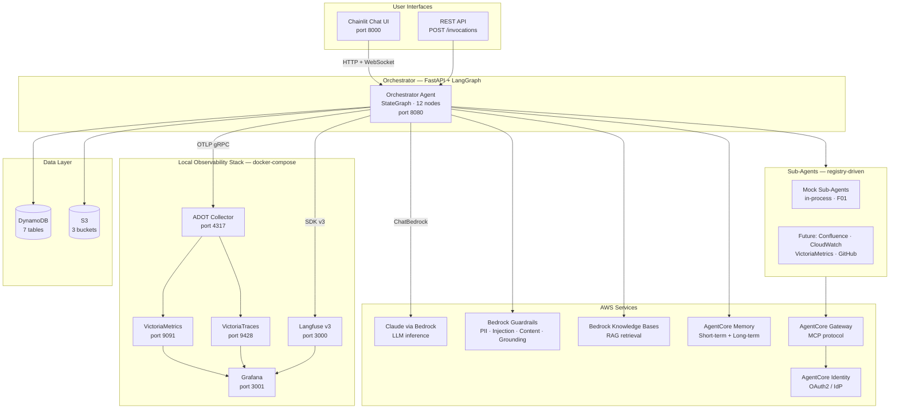
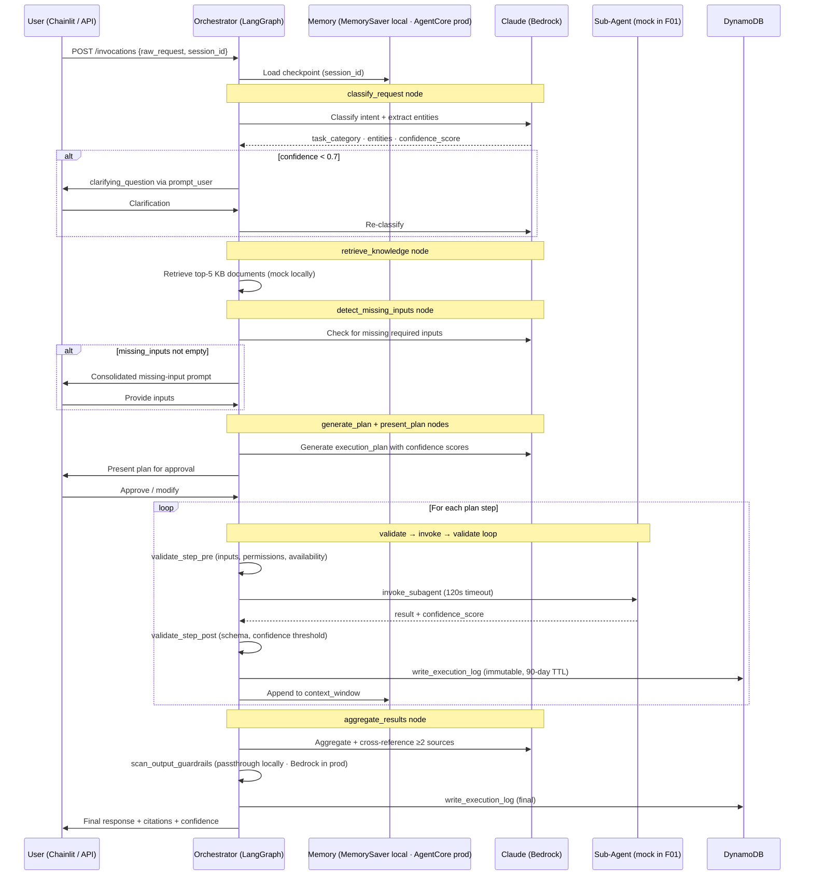
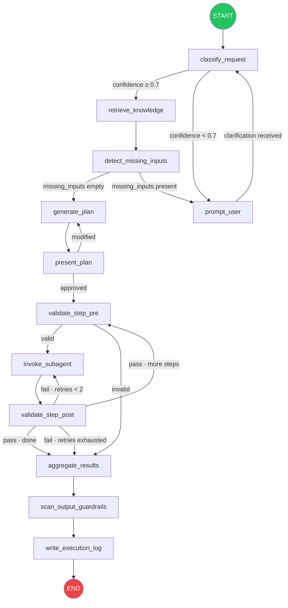
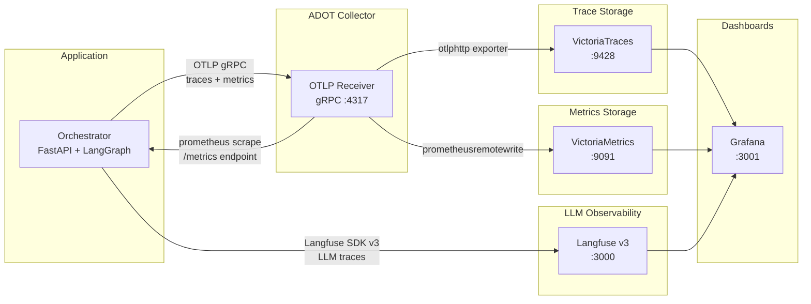
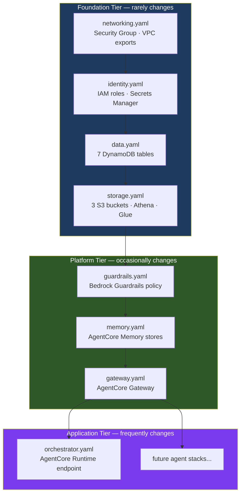

# ACE Agent — AWS Cloud Engineering Agent

A multi-agent AI system that acts as a senior Cloud Engineer co-worker for internal teams. Submit natural language requests and ACE Agent classifies intent, builds a validated execution plan, prompts for missing inputs, and orchestrates specialized sub-agents to interact with internal tools and knowledge systems — all with confidence scoring, citations, and full auditability.

Requests are classified into one of seven task categories: `incident_investigation`, `infrastructure_change`, `cost_analysis`, `deployment`, `monitoring_query`, `knowledge_retrieval`, `code_review`.

Built on Amazon Bedrock AgentCore Runtime with LangGraph for orchestration, LangChain for tool integrations, and Claude via Amazon Bedrock as the foundation model.

---

## Architecture



---

## Request Lifecycle



---

## LangGraph State Machine

The orchestrator is a 12-node LangGraph `StateGraph` defined in `src/orchestrator/graph.py`. Each node is a pure function `(OrchestratorState) → OrchestratorState` in its own file under `src/orchestrator/nodes/`.



Safety edges checked at every `invoke_subagent` entry:
- `hop_count ≥ 10` → route to `aggregate_results` with diagnostic error
- Cycle detected (`(agent_id, inputs_hash)` already in `visited_steps`) → halt
- `token_budget_used ≥ token_budget_limit` → halt with budget-exceeded error

Independent plan steps are dispatched concurrently via LangGraph's `Send` API (max 5 concurrent).

---

## Local Development

### Prerequisites

- Python 3.11+
- Docker & Docker Compose
- [uv](https://docs.astral.sh/uv/) package manager
- AWS credentials with Bedrock access (for LLM inference only)

### Quick Start

```bash
# 1. Clone and configure environment
cp .env.example .env
# Edit .env — set AWS_PROFILE and optionally LANGFUSE keys

# 2. Start the full observability + UI stack
docker compose up -d

# 3. Install Python dependencies
uv pip install -e ".[dev]"

# 4. Run the orchestrator (hot-reload)
uvicorn src.orchestrator.main:app --port 8080 --reload
```

The Chainlit UI is available at http://localhost:8000 and connects to the orchestrator automatically.

### Local Service URLs

| Service | URL | Purpose |
|---|---|---|
| Chainlit UI | http://localhost:8000 | Chat interface |
| Orchestrator API | http://localhost:8080 | FastAPI — `POST /invocations`, `GET /ping` |
| VictoriaTraces | http://localhost:9428 | Distributed trace UI + query API |
| Langfuse | http://localhost:3000 | LLM trace capture and analysis |
| Grafana | http://localhost:3001 | Unified dashboards (admin/admin) |
| VictoriaMetrics | http://localhost:9091 | Prometheus-compatible metrics |
| ADOT Collector | localhost:4317 | OTLP gRPC receiver |
| MinIO Console | http://localhost:9090 | S3-compatible blob store (Langfuse backend) |

### Environment Variables

Copy `.env.example` and configure:

```bash
# AWS — required for Bedrock LLM inference
AWS_PROFILE=<your-aws-profile>
AWS_REGION=us-east-1

# Orchestrator
MOCK_STORAGE=true              # In-memory fixtures instead of real DynamoDB/S3
MOCK_PROMPTS=true              # Local YAML templates instead of DynamoDB
TOKEN_BUDGET_LIMIT=50000       # Max tokens per request

# Observability
OTEL_STACK=local               # Activates local ADOT pipeline + Langfuse
OTEL_EXPORTER_OTLP_ENDPOINT=http://localhost:4317
LANGFUSE_PUBLIC_KEY=<local-key>
LANGFUSE_SECRET_KEY=<local-secret>
LANGFUSE_BASE_URL=http://localhost:3000

# Leave blank locally — production-only services
AGENTCORE_MEMORY_STORE_ID=
AGENTCORE_GATEWAY_ENDPOINT=
KNOWLEDGE_BASE_ID=
GUARDRAIL_ID=
CHAINLIT_AUTH_SECRET=
```

---

## Observability Stack



| Tool | What it does | When to use it |
|---|---|---|
| VictoriaTraces | Stores distributed traces from all orchestrator nodes. OTLP-native, receives traces via ADOT. | Debug request latency, trace the full execution path across all 12 graph nodes, inspect span timings. |
| VictoriaMetrics | Prometheus-compatible metrics backend. Receives metrics via ADOT's `prometheusremotewrite` exporter and scrapes the orchestrator's `/metrics` endpoint. | Monitor request volume, step failure rates, confidence score distributions, token budget usage. |
| Langfuse | LLM-specific trace capture. Wired via `langfuse.langchain.CallbackHandler` when `OTEL_STACK=local`. SDK v3 with env-var-based config (`LANGFUSE_HOST`). | Inspect individual LLM calls — prompts, completions, token counts, latency. Debug prompt template behavior. |
| Grafana | Unified dashboards pre-wired to VictoriaTraces, VictoriaMetrics, and Langfuse as data sources. | Single pane of glass for all observability data. Pre-built ACE Agent overview dashboard included. |
| ADOT Collector | Receives OTLP telemetry and routes traces to VictoriaTraces and metrics to VictoriaMetrics. Configured via `otel-collector-config.yaml`. | Central telemetry pipeline — you don't interact with it directly, but it's the backbone of the local observability stack. |

In production, ADOT routes traces to AWS X-Ray and AgentCore Observability provides CloudWatch-powered dashboards. Langfuse is local-only.

---

## Production Deployment

### CloudFormation Stack Tiers

Infrastructure is organized into three tiers by change frequency. Deploy in order — each tier depends on the one before it.



### Deploy Commands

All commands run from the `cloudformation/` directory via the Makefile.

```bash
# Full deployment — foundation → platform → application (in order)
make deploy-foundation ENV=production
make deploy-platform   ENV=production
make deploy-agents     ENV=production

# Update a single agent (fast path — no need to redeploy the full tier)
make deploy-agent AGENT=orchestrator ENV=production

# Preview changes before applying (always do this in production)
make preview STACK=orchestrator TIER=application/agents ENV=production

# Validate all templates
cfn-lint cloudformation/stacks/**/*.yaml

# Detect drift across all stacks
make drift-detect ENV=production

# Tear down everything (reverse dependency order, with confirmation prompt)
make destroy ENV=production
```

When `ENV=production`, the Makefile creates a CloudFormation change set, displays the diff, and waits for confirmation before executing. Non-production environments use direct deploy.

### Parameter Files

Each CloudFormation stack has its own parameter file under `cloudformation/parameters/`, named `{tier}-{stack}-{env}.json`:

| File | Stack |
|---|---|
| `local.json` | Shared local overrides — mock sub-agents, local ADOT endpoint, reduced token budget |
| `prod.json` | Shared production values — VpcId, SubnetIds, model IDs, full token budget |
| `foundation-networking-prod.json` | Foundation networking — VPC, subnets, CIDR |
| `foundation-identity-prod.json` | Foundation identity — IAM, Secrets Manager |
| `foundation-data-prod.json` | Foundation data — DynamoDB tables |
| `foundation-storage-prod.json` | Foundation storage — S3 buckets, Athena, Glue |
| `platform-guardrails-prod.json` | Platform guardrails — Bedrock Guardrails policy |
| `platform-memory-prod.json` | Platform memory — AgentCore Memory stores |
| `platform-gateway-prod.json` | Platform gateway — AgentCore Gateway |
| `application-orchestrator-prod.json` | Application orchestrator — AgentCore Runtime endpoint |

All environment differences are driven by these parameter files and environment variables. No `if env == "production"` branches in Python code.

---

## Local vs Production

| Concern | Local (docker-compose) | Production (AWS) |
|---|---|---|
| LangGraph checkpointer | `MemorySaver` (in-process) | `AgentCoreMemorySaver` (AgentCore Memory) |
| Long-term memory | Not available | `AgentCoreMemoryStore` (cross-session) |
| Sub-agents | Mock in-process (`src/agents/mock/`) | Real agents on AgentCore Runtime |
| Sub-agent routing | Direct in-process call | AgentCore Gateway (MCP protocol) |
| Knowledge retrieval | Mock retriever (fixture documents) | `AmazonKnowledgeBasesRetriever` (Bedrock KB) |
| Guardrails | Passthrough wrapper (no-op) | Bedrock Guardrails (PII, injection, content, grounding) |
| Trace backend | VictoriaTraces (via ADOT) | AWS X-Ray (via ADOT) |
| Metrics backend | VictoriaMetrics (via ADOT) | AgentCore Observability (CloudWatch) |
| LLM tracing | Langfuse v3 (`OTEL_STACK=local`) | AgentCore Observability |
| Dashboards | Grafana (port 3001) | AgentCore Observability (CloudWatch dashboards) |
| Authentication | Disabled (`CHAINLIT_AUTH_SECRET` unset) | OAuth2 via AgentCore Identity |
| Prompt templates | Local YAML files (`MOCK_PROMPTS=true`) | `prompt-template-registry` DynamoDB table |
| Storage | In-memory fixtures (`MOCK_STORAGE=true`) | DynamoDB (7 tables) + S3 (3 buckets) |
| Container platform | Docker Compose (ARM64) | AgentCore Runtime (Firecracker, ARM64) |
| LLM inference | Claude via Bedrock (configurable via `BEDROCK_MODEL_ID`) | Claude via Bedrock (same) |

---

## Testing

```bash
# Run unit tests (excludes integration tests)
uv run pytest tests/ --ignore=tests/integration -v --tb=short

# Run with mock storage and prompts (matches CI)
MOCK_STORAGE=true MOCK_PROMPTS=true uv run pytest tests/ --ignore=tests/integration -v

# Validate CloudFormation templates
cfn-lint cloudformation/stacks/**/*.yaml cloudformation/modules/**/*.yaml
```

Each graph node is a pure function and can be tested in isolation by constructing a minimal `OrchestratorState` dict and asserting on the returned state. Property-based tests use `hypothesis`.

---

## CI/CD

GitHub Actions runs on every PR to `main` with three parallel jobs:

| Job | What it does |
|---|---|
| `test` | Installs dependencies via `uv`, runs `pytest` with `MOCK_STORAGE=true` and `MOCK_PROMPTS=true` |
| `cfn-lint` | Lints all CloudFormation templates under `cloudformation/stacks/` and `cloudformation/modules/` |
| `docker-build` | Builds the orchestrator ARM64 Docker image (no push — build validation only) |

```yaml
# Triggered on PR to main
on:
  pull_request:
    branches: [main]
```

---

## Project Structure

```
├── src/
│   ├── orchestrator/          # LangGraph StateGraph + FastAPI entrypoint
│   │   ├── graph.py           # OrchestratorState + 12 nodes + conditional edges
│   │   ├── nodes/             # One file per graph node
│   │   ├── memory.py          # MemorySaver (local) / AgentCoreMemorySaver (prod)
│   │   ├── prompts.py         # load_prompt_template() from DynamoDB
│   │   └── main.py            # FastAPI: POST /invocations, GET /ping
│   ├── agents/                # Sub-agents (mock in F01, real in F04+)
│   ├── guardrails/            # Bedrock Guardrails wrapper
│   ├── storage/               # DynamoDB + S3 helpers (all table/bucket access)
│   ├── observability/         # ADOT + Langfuse setup
│   └── eval/                  # Offline evaluation pipeline
├── cloudformation/
│   ├── stacks/
│   │   ├── foundation/        # networking, identity, data, storage
│   │   ├── platform/          # guardrails, memory, gateway
│   │   └── application/agents/# One stack per agent
│   ├── modules/               # Reusable CloudFormation modules
│   ├── parameters/            # Per-stack: {tier}-{stack}-{env}.json + shared local/production
│   └── Makefile               # Deploy/preview/destroy targets
├── grafana/                   # Pre-built dashboards + provisioning
├── docker-compose.yml         # Full local dev stack
├── otel-collector-config.yaml # ADOT routing config
├── Dockerfile.orchestrator    # ARM64 multi-stage build
└── Dockerfile.chainlit        # Chainlit UI container
```
